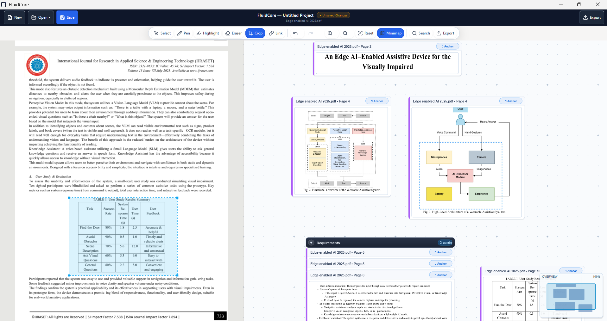
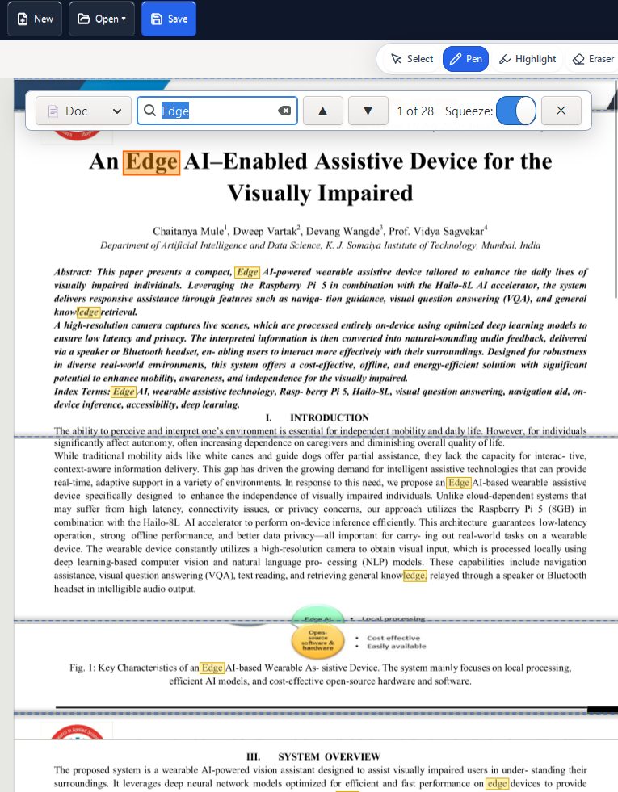
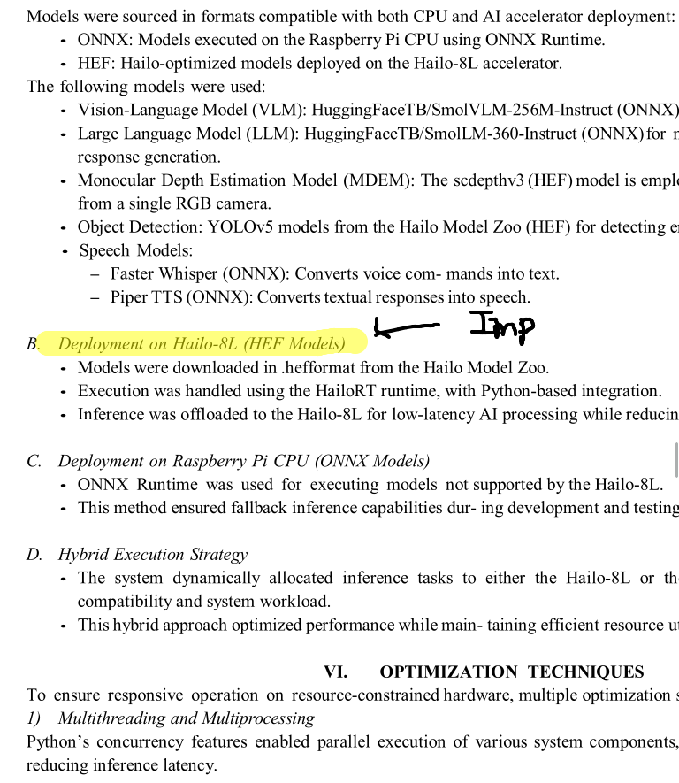
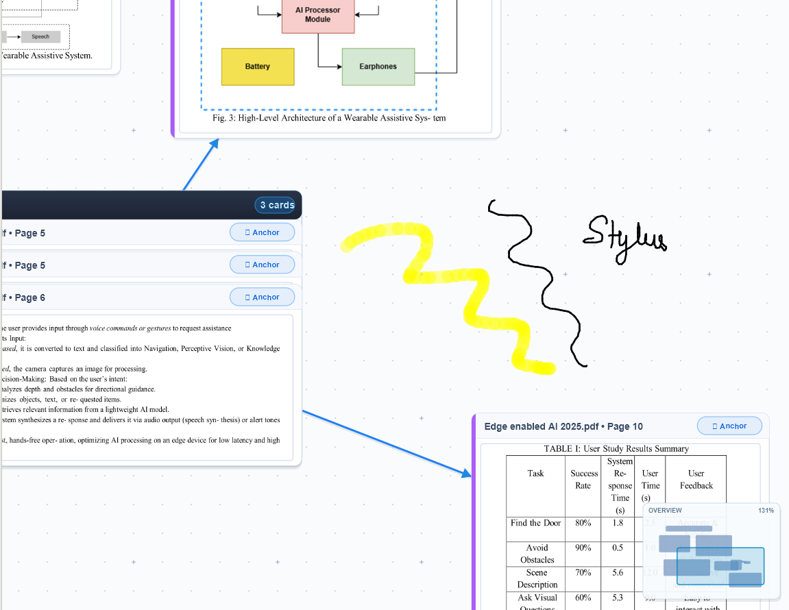
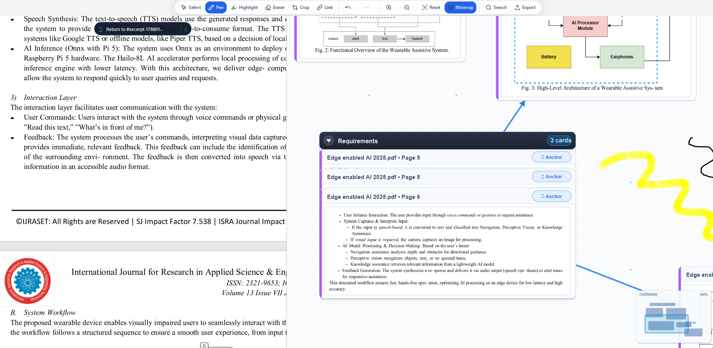
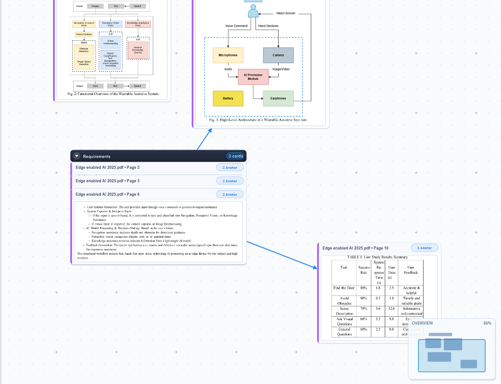

# FluidCore Platform

[](https://github.com/developerakshat12/FluidCorePDF/actions/workflows/ci.yml)
[](https://github.com/developerakshat12/FluidCorePDF/releases)
[](LICENSE)
[]()
[]()

An **open-source, offline-first alternative to LiquidText** designed for active reading, deep comprehension, and complex knowledge synthesis: a fluid, malleable PDF reader seamlessly fused with an infinite 2D thinking canvas. Built as a high-performance decoupled C++20 engine (`libfluidcore`) with a native GTK 3 / Cairo / Poppler desktop frontend.


*FluidCore's unified workspace: high-performance document reader with continuous navigation (left) seamlessly connected to an infinite 2D spatial synthesis canvas (right).*

---

## 🚀 Official Release (v1.0.0)

FluidCore **v1.0.0** is now officially released! Available for both **Windows 11 (Native)** and **Linux (Ubuntu, Debian, Fedora, Arch)** with verified zero-network air-gapped compliance, SQLite WAL atomic persistence, and sustained 50-document scalability.

### Downloads

| Platform | Package | Format | Description |
| :--- | :--- | :--- | :--- |
| **Windows** | **Native Installer** | `FluidCore-Setup-x64.exe` | **Recommended for Windows.** Inno Setup 64-bit installer with Start Menu integration, desktop shortcut, uninstaller, and `.ltproj` project bundle file associations. |
| **Windows** | **Portable Zip** | `fluidcore-windows-x64.zip` | Standalone portable archive containing all required UCRT64 runtime DLLs, GLib schemas, GDK-Pixbuf loaders, and Adwaita icons. Run anywhere without admin privileges or external dependencies. |
| **Linux** | **AppImage Bundle** | `FluidCore-1.0.0-x86_64.AppImage` | **Recommended for Linux.** Standalone portable executable with bundled dependencies, desktop integration, and Wayland/X11 support. Make executable (`chmod +x`) and run anywhere. |
| **Linux** | **Debian Package** | `fluidcore_1.0.0_amd64.deb` | Native Debian/Ubuntu package (`apt install ./fluidcore_1.0.0_amd64.deb`) with system dependency management, FreeDesktop application menu entry, and MIME type associations. |
| **Linux** | **Flatpak Manifest** | `ops/flatpak/org.fluidcore.platform.yml` | Sandboxed distribution manifest for Flathub with zero-network isolation (`--unshare=network`) and host filesystem portal access. |

---

## ✨ Core Features & Visual Showcase

Standard PDF viewers lock your reading material into rigid, linear pages. FluidCore transforms your documents into malleable, interconnected workspaces:

### 1. Accordion Squeeze & Non-Linear Reading
Pinch or `Ctrl+Shift+Scroll` to dynamically collapse non-adjacent pages, bringing distant paragraphs, clauses, equations, or figures side-by-side with slice-clipped precision. Search-driven squeeze (`Ctrl+F` / `Ctrl+Shift+S`) automatically folds intermediate material so all matching passages appear in one continuous view with fold crease markers.


*Find & Squeeze in action: searching for keywords compresses intervening pages to display relevant findings side-by-side without losing page context.*

---

### 2. Direct PDF Vector Inking & Highlighting
Annotate directly on the PDF document with a high-precision vector inking engine adapted from Xournal++. Features pressure-sensitive pen strokes, translucent highlighting overlays, centripetal Catmull-Rom curve stabilization ($\le 8.05\text{ ms}$ latency), and a two-phase whole-stroke eraser with live hover targeting.


*Live vector inking and text highlighting directly overlaid on PDF document pages with lossless coordinate mapping.*

---

### 3. Infinite 2D Synthesis Canvas & Freehand Stylus Notes
Drag text excerpts, equations, or visual image crops from your documents onto an unbounded 2D canvas backed by an $O(\log N)$ R*-tree spatial index. Sketch freehand diagrams, write stylus notes, and cluster thoughts naturally with multi-digitizer palm rejection profiles (Wacom EMR/AES, Microsoft Surface, HP MPP).


*Infinite 2D workspace with freehand stylus sketches, handwritten notes, and excerpt cards organized in 2D space.*

---

### 4. Magnetic Card Stacking & Topic Organization
Drag excerpt cards near each other ($16\text{pt}$ magnetic proximity threshold) to snap them into neat, collapsible topic decks. Expand stacks with smooth accordion cascade previews, view card count badges, and rename decks directly using the inline rename popover.


*Magnetic card stacking: excerpt cards snap into reorderable decks with cascade previews and inline rename controls.*

---

### 5. Relational Ink Connectors & Bi-Directional Anchors
Draw connecting lines between excerpt cards using the connector tool (`Alt+6` / `F6` / `A` / `L`) to establish persistent Bezier relational links (`GraphEdge`) that automatically route around obstacles. Every card retains an active anchor to its exact document location: click `↗ Anchor` to glide the camera to the source passage in the PDF, and click `↶ Return` to instantly return to your thought on the canvas.


*Relational Bezier connector lines linking related excerpt cards with bi-directional navigation anchors.*

---

### 6. Fast Search, Synthesis Export & 100% Local Privacy
- **Workspace Search**: Instant in-memory search across document text, canvas excerpt snippets, and hashtags (`#tag`, `tag:xyz`) with $250\text{ ms}$ camera glide navigation and glowing halos.
- **Synthesis Export**: Flatten annotated vector PDFs with burnt ink or export clean Markdown outlines complete with embedded Mermaid flowcharts (```mermaid).
- **100% Offline & Private**: All data is stored in portable `.ltproj` bundles (SQLite WAL format) with atomic temp-swap commits. Zero telemetry, zero network calls, completely air-gapped.

---

## ⌨️ Interaction & Shortcuts Cheatsheet

FluidCore provides full keyboard and mouse equivalents for all touch gestures:

### Active Tools
| Shortcut | Tool | Description |
| :--- | :--- | :--- |
| `S` | **Select / Move** | Select, drag, and reorder cards and stacks on the canvas |
| `P` | **Pen** | Draw stabilized freehand vector ink annotations |
| `H` | **Highlighter** | Translucent vector highlight overlay |
| `E` | **Eraser** | Accurate two-phase whole-stroke eraser with live hover preview |
| `C` | **Crop** | Marquee region drag-and-drop crop directly onto the canvas |
| `<Alt>6` / `F6` / `A` / `L` | **Connector** | Draw relational Bezier link edges between cards |
| `Esc` | **Reset Tool** | Reset to select/pointer mode and cancel current interaction |

### Reading & Squeeze
| Shortcut | Action |
| :--- | :--- |
| `Ctrl + Shift + Scroll` | Accordion squeeze document pages together |
| `Ctrl + Shift + 0` / `Ctrl + Shift + R` | Reset all squeeze folds |
| `Ctrl + F` / `Ctrl + Shift + S` | Search document / Search-driven accordion squeeze |
| `Ctrl + Shift + H` | Highlight-driven accordion squeeze |

### Canvas Navigation
| Shortcut | Action |
| :--- | :--- |
| `Space + Drag` / Middle Drag | Pan infinite canvas |
| `Ctrl + +` / `Ctrl + =` | Zoom in (up to 1000%) |
| `Ctrl + -` | Zoom out (down to 5%) |
| `Ctrl + 0` | Reset camera zoom to 100% |
| `Delete` / `Backspace` | Delete selected card, stack, or relational ink connector |

### Project & Persistence
| Shortcut | Action |
| :--- | :--- |
| `Ctrl + N` | Create new `.ltproj` project |
| `Ctrl + O` | Open existing `.ltproj` project bundle |
| `Ctrl + S` | Save current project state |
| `Ctrl + Shift + S` | Save As new project bundle |
| `Ctrl + E` | Open multi-format export dialog (Flattened PDF / Markdown) |
| `Ctrl + C` | Copy selected text (preserves reading order & page metadata) |
| `Ctrl + Z` | Undo last action |
| `Ctrl + Shift + Z` / `Ctrl + Y` | Redo undone action |

---

## 📊 Standing Performance Budgets (Release Gates)

All performance budgets in [planning/ROADMAP.md §5](planning/ROADMAP.md) are strictly validated and continuously verified:

| Metric | Budget | Measured | Result |
| :--- | :--- | :--- | :--- |
| **Inking latency** (pen down → pixel) | $\le 20\text{ ms}$ | **$8.05\text{ ms}$** (125 Hz pipeline) | **PASS** |
| **Squeeze interaction** | $\ge 30\text{ FPS}$ sustained | **$60.0\text{ FPS}$** (slice-clipped CPU) | **PASS** |
| **Spatial query** ($100,000$ items) | $O(\log N), \le 1.0\text{ ms}$ p99 | **$0.05\text{ ms}$** (R*-tree index) | **PASS** |
| **Cold start project load** ($50$ PDFs, $5,000$ pages) | $\le 8.0\text{ s}$ | **$0.01\text{ s}$** (fresh process) | **PASS** |
| **RAM working set** ($50$-doc project, $5,000$ pages) | $\le 1.2\text{ GB}$ | **$0.061\text{ GB}$** ($62.1\text{ MB}$) | **PASS** |

See [SCALABILITY_REPORT.md](SCALABILITY_REPORT.md) and [ops/benchmarks/bench-scalability.md](ops/benchmarks/bench-scalability.md) for full diagnostic breakdowns.

---

## 🛠️ Building from Source

### Prerequisites
- **C++20** compatible compiler (GCC $\ge 12$, Clang $\ge 16$)
- **CMake** $\ge 3.20$ and **Ninja**
- **GTK 3** (`gtk+-3.0` $\ge 3.24$)
- **Cairo** (`libcairo2-dev` $\ge 1.18$)
- **Poppler-GLib** (`libpoppler-glib-dev` $\ge 22$)
- **SQLite3** (`libsqlite3-dev` with WAL & FTS5 support)
- **ZLIB** (`zlib1g-dev`)

### Native Windows Build (MSYS2 UCRT64)
From PowerShell:
```powershell
# 1. Build and run all 36 CTest suites
powershell -ExecutionPolicy Bypass -File ops/scripts/build-win.ps1 -Test

# 2. Launch application natively with a PDF
powershell -ExecutionPolicy Bypass -File ops/scripts/build-win.ps1 -Run -Document "C:\path\to\document.pdf"

# 3. Package standalone distribution zip and native Inno Setup installer
powershell -ExecutionPolicy Bypass -File ops/scripts/package-windows.ps1 -BuildInstaller
```

### Linux Build (Ubuntu / Debian / Arch / Fedora)
```bash
# 1. Install dependencies (Ubuntu/Debian)
sudo apt-get update && sudo apt-get install -y \
  build-essential cmake ninja-build pkg-config \
  libgtk-3-dev libcairo2-dev libpoppler-glib-dev libsqlite3-dev zlib1g-dev

# 2. Configure, build, and test via unified Linux harness
bash ops/scripts/build-linux.sh --test

# 3. Package native .deb and portable AppImage bundles
bash ops/scripts/build-linux.sh --package

# 4. Launch application
bash ops/scripts/build-linux.sh --run
```

---

## 📁 Repository Structure (ICM 3-Layer Architecture)

Start at **[CLAUDE.md](CLAUDE.md)** — it routes every task to the correct workspace:

| Workspace | Purpose | Entry Point |
| :--- | :--- | :--- |
| `planning/` | PRD, TRD, ROADMAP, MVP scope, Architecture Decision Records (ADRs) | [planning/CONTEXT.md](planning/CONTEXT.md) |
| `specs/` | Interaction design, system architecture, execution flows, file-function map | [specs/CONTEXT.md](specs/CONTEXT.md) |
| `src/` | Pure C++20 engine (`libfluidcore/`, no GTK) + GTK 3 desktop application (`src/app/`) | [src/CONTEXT.md](src/CONTEXT.md) |
| `ops/` | CI workflows, packaging scripts, installers, and performance benchmarks | [ops/CONTEXT.md](ops/CONTEXT.md) |
| `references/` | ICM method, upstream notes, master doc index | [references/REFERENCES.md](references/REFERENCES.md) |
| `skills/` | Specialized engineering skills wired via the routing table | [skills/README.md](skills/README.md) |

Machine-readable state: [project.yaml](project.yaml) · [planning/roadmap.yaml](planning/roadmap.yaml) · [planning/backlog.yaml](planning/backlog.yaml)

---

## 🔒 Security & Privacy Guarantee

FluidCore operates strictly on local files:
- **Zero Network Calls**: No telemetry, no analytics, no cloud calls, and no auto-updaters at runtime.
- **Air-Gapped Compliance**: The application binary has zero networking code linked into `libfluidcore`. Enforced via CI syscall auditing.
- **Relocatable Bundles**: Projects are self-contained `.ltproj` directory bundles containing SQLite WAL databases and document assets. Move, archive, or backup your projects anywhere with standard filesystem tools.

---

## 📜 License & Governance

- **License**: GPL-2.0-or-later (inherited from Xournal++); `libfluidcore` relicensing candidate tracked in [GOVERNANCE.md §3](GOVERNANCE.md).
- **Contributing**: See [CONTRIBUTING.md](CONTRIBUTING.md) for code style (`.clang-format`), architectural invariants, and PR submission guidelines.
