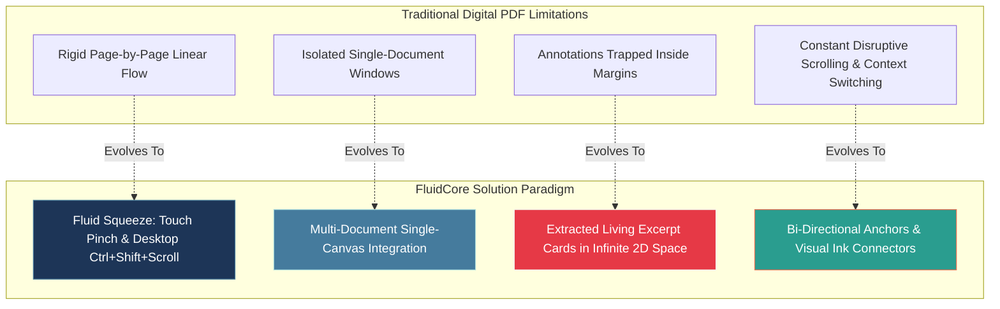
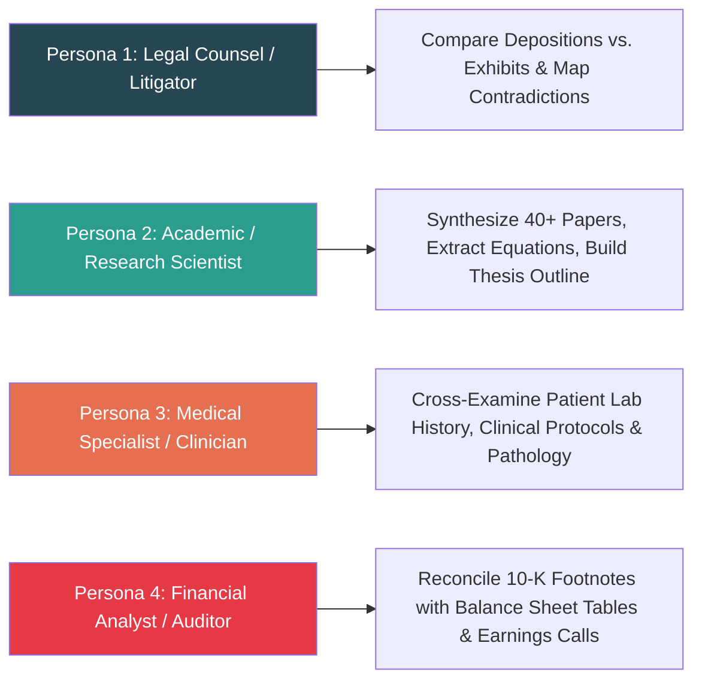
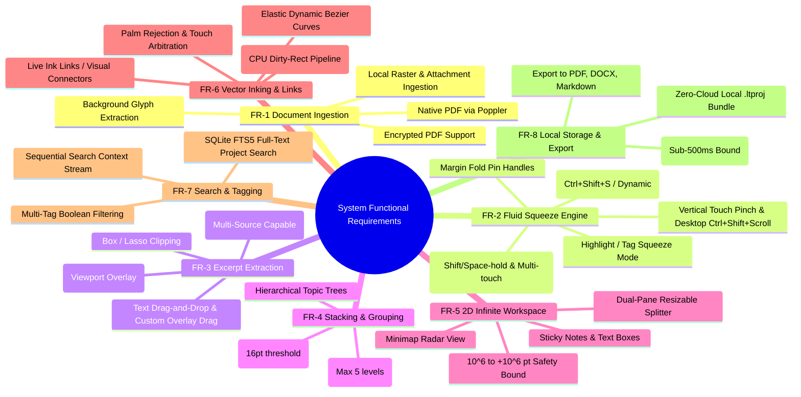
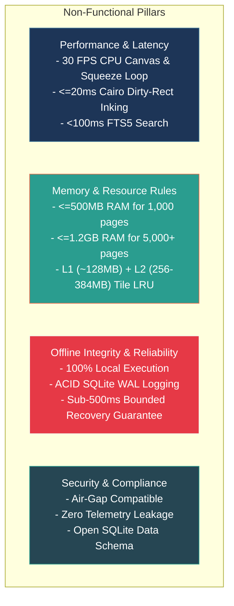
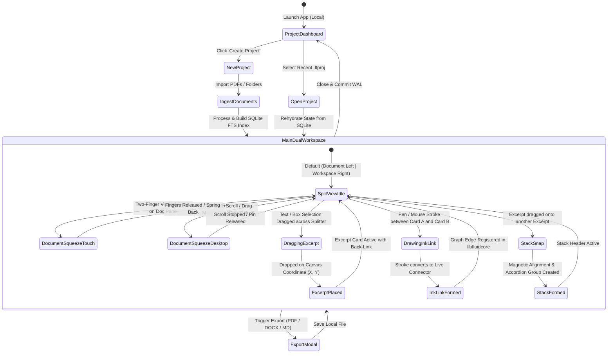

# Product Requirements Document (PRD)
## Offline Fluid Document Synthesis Platform (Fluid Synthesis Paradigm)

---

## 1. Executive Summary & Problem Statement

### 1.1 Executive Overview
Knowledge workers—including attorneys, researchers, clinicians, intelligence analysts, and finance professionals—spend up to 40% of their working hours engaged in **Active Reading**. Active reading is an intense, iterative cognitive process of highlighting, extracting, cross-referencing, comparing non-adjacent passages, synthesizing multi-source data, and building structured hypotheses.

While digital devices have replaced physical paper, current PDF viewers merely digitize the static physical page. They maintain the severe limitations of paper while failing to exploit digital affordances like dynamic spatial manipulation, non-linear folding, and associative graph linking.

This document specifies the requirements for an **Offline-First Fluid Document Synthesis Platform**, engineered for **Active Reading and Fluid Synthesis**. The platform merges a flexible, malleable document reader with an infinite associative 2D workspace, architected via a **Decoupled High-Performance C++ Core Engine (`libfluidcore`)** integrated with a **Linux-primary GTK 3 / Cairo desktop frontend** (extending Xournal++), enabling users to deconstruct multi-page, multi-document files into interactive excerpt graphs with zero cloud dependencies.

### 1.2 The Core Problem
1. **The Digital Paper Paradox**: Standard PDF viewers lock content into rigid boxes, requiring users to repeatedly scroll back and forth between distant pages or juggle multiple disconnected application windows.
2. **The Synthesis & Context Gap**: When users copy text or images from a PDF into a separate note-taking app, the excerpt loses its live context. If the source quote is ambiguous, finding the original passage in a large dossier requires manual re-searching.
3. **The Air-Gap & Privacy Mandate**: Legal trial discovery, medical patient files, intelligence dossiers, and financial filings cannot be uploaded to third-party cloud servers. Knowledge workers demand an ultra-fast, standalone desktop solution that operates **100% offline** with zero telemetry leaks and local data sovereignty.

---

## 2. Target Personas & Real-World Use Cases

### 2.1 Persona 1: Senior Litigator / Trial Attorney (Sarah)
* **Goal**: Review 20 deposition transcripts, contracts, and evidentiary filings to construct a motion for summary judgment.
* **Pain Point**: Flipping between exhibits and witness testimonies in standard PDF viewers causes cognitive overload; quotes copied into Word lose page/line references.
* **FluidCore Application**: Pulls 50 key deposition clauses into the workspace, connects conflicting testimonies using red ink links, snaps them into topic stacks, and exports a fully cited draft motion.

### 2.2 Persona 2: Postdoctoral Research Scientist (Dr. Aris)
* **Goal**: Conduct a systematic literature review synthesizing 45 research papers on neural interfaces.
* **Pain Point**: Equations, charts, and methodology sections are scattered across dozens of PDFs.
* **FluidCore Application**: Loads all 45 papers into one project; uses "Highlight Squeeze" to read only critical sections; clips figures and equations into an infinite canvas; organizes findings into a visual taxonomy.

### 2.3 Persona 3: Clinical Specialist / Pathologist (Dr. Elena)
* **Goal**: Review comprehensive patient medical history, multi-year laboratory tests, and recent clinical trial literature.
* **Pain Point**: Must work on strictly air-gapped hospital workstations where cloud sync is strictly prohibited by HIPAA/GDPR regulations.
* **FluidCore Application**: Operates 100% locally; pinches lab reports to compare 2022 vs. 2026 liver panel values side-by-side; attaches clinical literature excerpts to patient diagnosis nodes.

### 2.4 Persona 4: Equity Research Analyst (Marcus)
* **Goal**: Audit annual 10-K reports, proxy statements, and quarterly earnings calls for 8 competitor firms.
* **Pain Point**: Footnotes are buried 60 pages away from the primary balance sheet tables.
* **FluidCore Application**: Pinches the 10-K to place balance sheet line items directly next to their explanatory footnotes; pulls comparative revenue tables into the workspace and links them with directional trend lines.

---

## 3. Product Vision & Architectural Strategy

### 3.1 Vision Statement
To build the most fluid, cognitively transparent, and high-performance desktop reading and synthesis environment—empowering knowledge workers to think, compare, and discover relationships across vast volumes of complex literature with the speed of thought.

### 3.2 Architectural Pillars
1. **Decoupled C++ Core Engine (`libfluidcore`)**: High-performance, cross-platform pure C++20 engine encapsulating spatial R*-Tree indexing, piecewise non-linear coordinate transforms, bi-directional relational graph topology $G=(V, E)$, and SQLite WAL persistence—completely decoupled from GUI frameworks for maximum testability and stability.
2. **Unified Dual Interaction Subsystem**: First-class support for both **multi-touch / active stylus** and **desktop mouse / keyboard** interaction paradigms (margin fold pins, `Ctrl+Shift+Scroll` accordion folding, `Ctrl+Shift+S` search squeeze mode, `Shift/Space-hold` bookmark peeking).
3. **Living Knowledge Graph**: Every extracted note, quote, or clipped diagram remains tethered via live bi-directional links to its immutable source document, supporting single- or multi-passage synthesis.
4. **Air-Tight Local Privacy & SQLite WAL Storage**: Guaranteed offline-only execution with zero network requirements, sub-500ms crash-safe transaction logging in a local `.ltproj` directory bundle (packaged to a compressed archive for sharing/export).

---

## 4. Comprehensive Functional Requirements (FRD)

### Module 1: Document Ingestion & Multi-Format Management
| Requirement ID | Requirement Name | Description | Priority |
| :--- | :--- | :--- | :--- |
| **FR-1.1** | Native PDF Ingestion | Load standard PDF 1.4 to 2.0 files up to 2,500 pages with rapid progressive rendering via Poppler GLib. | **P0** |
| **FR-1.2** | Multi-Document Import | Allow importing and organizing up to 50 documents / 10,000 pages per project (tested, supported limit). Up to 100 documents is an untested stretch target beyond the v1.0 validation envelope. | **P0** |
| **FR-1.3** | Document & Image Attachment | Ingest local image files (`.png`, `.jpg`, `.webp`) and attach external reference documents to workspace nodes locally without cloud APIs. | **P1** |
| **FR-1.4** | Encrypted PDF Support | Support password-protected PDF viewing and decryption using local credential prompts. | **P1** |
| **FR-1.5** | Background Text & Glyph Extraction | Asynchronously extract text metrics, glyph boundaries, and normalized bounding boxes upon import for instant hit-testing and search. | **P0** |

### Module 2: Fluid Document Viewer & Dynamic Squeeze Engine
| Requirement ID | Requirement Name | Description | Priority |
| :--- | :--- | :--- | :--- |
| **FR-2.1** | Multi-Touch & Desktop Pinch-to-Squeeze | Two-finger pinch gesture on touch devices OR `Ctrl+Shift+Scroll` at mouse cursor accordion-folds non-adjacent pages, displaying target sections side-by-side. | **P0** |
| **FR-2.2** | Margin Fold Pin Handles | Interactive visual fold pins on the document margin track allowing mouse users to click-and-drag fold creases to collapse intermediate sections. | **P0** |
| **FR-2.3** | Squeeze Search Mode | Squeezing while search is active (or pressing `Ctrl+Shift+S`) collapses non-matching pages, presenting search hits sequentially with adjustable surrounding context. | **P0** |
| **FR-2.4** | Highlight / Tag Squeeze | Squeezing with highlight filter enabled collapses un-highlighted sections, generating a continuous sequence of paragraphs containing critical highlights. | **P0** |
| **FR-2.5** | Bookmark Peeking (`beginPeek` / `endPeek`) | Holding one finger on Page $N$ while skimming with another, OR holding `Shift`/`Space` while scrolling, allows temporary inspection; releasing returns instantly to Page $N$. | **P1** |
| **FR-2.6** | Smooth Spring-Back Animation | Releasing squeeze gestures smoothly animates pages back to standard reading layout with damped spring physics. | **P0** |

### Module 3: Excerpt Extraction & Bi-Directional Source Anchoring
| Requirement ID | Requirement Name | Description | Priority |
| :--- | :--- | :--- | :--- |
| **FR-3.1** | Text Excerpt Drag & Drop | Dragging selected text across the document boundary onto the canvas instantiates an interactive `ExcerptCardNode` via smooth gesture preview. | **P0** |
| **FR-3.2** | Box/Lasso Image & Graphic Clipping | Bounding rectangular or freehand regions clips figures, tables, and equations as high-resolution visual excerpt cards. | **P0** |
| **FR-3.3** | Deep Bi-Directional Navigation | Tapping an excerpt card's source arrow instantly navigates the document pane to the exact page and paragraph with a luminous pulse highlight. Supports multiple anchors per synthesis card; when multiple anchors exist, the first anchor by creation order is the primary navigation target. | **P0** |
| **FR-3.4** | Floating Return Anchor Pill | Navigating to a source document passage renders an interactive, floating "Return to Excerpt" pill in the viewport overlay pass to jump back to the exact workspace coordinate. | **P0** |
| **FR-3.5** | Document-to-Workspace Reverse Lookup | Tapping highlighted text in the document illuminates all workspace cards derived from that specific passage. | **P0** |

### Module 4: Excerpt Snapping, Stacking, and Hierarchical Grouping
| Requirement ID | Requirement Name | Description | Priority |
| :--- | :--- | :--- | :--- |
| **FR-4.1** | Magnetic Edge Snapping | Dragging cards within a 16pt proximity threshold automatically snaps them into aligned vertical or horizontal clusters. Precedence rule: if the dragged card overlaps an existing card by $>50\%$ of its area, stack-drop wins and magnetic snapping does not apply. | **P0** |
| **FR-4.2** | Accordion Card Stacking | Dropping Card B directly on Card A creates a collapsible `CardStackNode` with header title and count badge. | **P0** |
| **FR-4.3** | Multi-Level Indentation / Trees | Support nesting excerpt cards into parent-child topic hierarchies representing conceptual outlines (up to 5 nesting levels). | **P1** |
| **FR-4.4** | Stack Expansion & Collapse | One-tap toggle to expand stack cards or collapse them into a single-line summary card. | **P0** |

### Module 5: 2D Infinite Workspace Canvas & Spatial Synthesis
| Requirement ID | Requirement Name | Description | Priority |
| :--- | :--- | :--- | :--- |
| **FR-5.1** | Infinite Virtual Viewport | Continuous pan and zoom across a virtual 2D canvas with coordinates in unbounded $\mathbb{R}^2$ (clamped to $[-10^6, +10^6]\text{pt}$ floating-point safety bounds) powered by an R*-Tree spatial index. | **P0** |
| **FR-5.2** | Mixed-Media Freeform Objects | Support placing rich-text boxes, color-coded sticky notes, geometric shapes, and external image attachments. | **P0** |
| **FR-5.3** | Adjustable Split-Screen Divider | Resizable `GtkPaned` splitter between Document Reader pane and Workspace Canvas, including full-screen toggles. | **P0** |
| **FR-5.4** | Minimap Radar Navigation | Small overlay minimap displaying workspace card clusters with quick-drag viewport framing. | **P1** |

### Module 6: Vector Inking & Live Ink Links (Visual Hyperlinks)
| Requirement ID | Requirement Name | Description | Priority |
| :--- | :--- | :--- | :--- |
| **FR-6.1** | Low-Latency Vector Inking | Pressure-sensitive vector inking with pen, highlighter, calligraphic, and eraser tools rendered via optimized Cairo CPU dirty-rect pipeline. | **P0** |
| **FR-6.2** | Live Ink Links (Relational Connectors) | Drawing a continuous stroke between two cards (or card and document) converts the stroke into an active relational edge in the core graph. | **P0** |
| **FR-6.3** | Elastic Connector Geometry | Connected ink lines dynamically bend and maintain topological attachment using cubic Bezier spline evaluation when excerpt cards move. | **P0** |
| **FR-6.4** | Connector Endpoint Navigation | Tapping either endpoint of an Ink Link smoothly pans the viewport to bring the connected node or document passage into focus. | **P0** |
| **FR-6.5** | Palm Rejection & Input Arbitration | InputContext arbitration allowing drawing with active stylus while panning/zooming canvas with touch or mouse. | **P0** |

### Module 7: Search, Tagging & Synthesis Layer
| Requirement ID | Requirement Name | Description | Priority |
| :--- | :--- | :--- | :--- |
| **FR-7.1** | Unified Full-Text Project Search | Instant sub-100ms search across all imported documents, excerpt cards, sticky notes, and text boxes via SQLite FTS5. | **P0** |
| **FR-7.2** | Search Hit Density Graph & Slice Stream | Visual scrubber track showing search hit distribution and a dedicated sidebar stream displaying sequential hits with surrounding context sentences extracted via Poppler text block bounding box aggregation. | **P1** |
| **FR-7.3** | Multi-Tag Boolean Filtering | Attach custom colored tags (`#Tax`, `#Liability`) to highlights/cards and filter workspace using `AND`/`OR`/`NOT` logic. | **P1** |

### Module 8: Offline Local Storage, Crash Recovery & Export
| Requirement ID | Requirement Name | Description | Priority |
| :--- | :--- | :--- | :--- |
| **FR-8.1** | 100% Offline Standalone Operation | Zero internet connectivity requirements for all core features, reading, inking, linking, indexing, and exporting. | **P0** |
| **FR-8.2** | Self-Contained Project Package (`.ltproj`) | Persist complete workspace state, PDF binaries, SQLite graph database, ink vectors, and assets in a local directory bundle (exportable as compressed single-file container). | **P0** |
| **FR-8.3** | Real-Time WAL Crash Recovery | Continuous transaction logging via SQLite WAL ensures sub-500ms bounded recovery of inking, notes, and card positions after sudden power or process failure. | **P0** |
| **FR-8.4** | Multi-Format Export Engine | Export to standard annotated PDF, high-res Workspace PDF canvas, structured Word `.docx` outline, Markdown `.md`, and `.ltproj` portable bundle. | **P0** |

---

## 5. Non-Functional Requirements (NFR)

### 5.1 Performance & Latency SLAs
* **Inking Latency**: $\le 20\text{ms}$ active inking response via optimized Cairo transient mask and dirty-rectangle damage tracking (sub-15ms on hardware digitizer event coalescing).
* **UI & Rendering Framerate**: Solid 30 FPS CPU rendering during multi-touch canvas panning, zooming, and accordion squeezing (with graceful degradation on complex vector-heavy PDFs).
* **Squeeze Gesture Response**: Piecewise coordinate mapping $\mathcal{T}(Y_{doc})$ computes in $<2.5\text{ms}$ per frame with zero visual hitching.
* **Search Execution Time**: Sub-100ms query response across 50 documents / 10,000 pages using local SQLite FTS5 index.
* **Cold App Launch Time**: $<1.5\text{ seconds}$ to active canvas; $<2.5\text{ seconds}$ for large project file reopening.

### 5.2 Memory Footprint & Resource Management
* **Baseline Working Set**: $\le 500\text{MB}$ RAM for a project containing 1,000 pages of PDF documents.
* **Large Project Cap**: $\le 1.2\text{GB}$ RAM for a project containing 50 documents (5,000+ pages) and 2,000 workspace excerpt cards.
* **Tile Cache Budget**: Two-tier dynamic raster tile cache:
  * **L1 Cache (Active Viewport)**: ~128MB ARGB32 uncompressed tiles (required to support 4K/HiDPI rendering matrices without thrashing).
  * **L2 Cache (Pre-fetched & Adjacent Pages)**: 256MB to 384MB dynamic pool with strict LRU eviction, guaranteeing working memory stays within the ≤1.2GB cap.
* **Battery Consumption**: Optimized compute footprint ($<5\%$ CPU utilization while idling with open 2,000-page project).

### 5.3 Offline Reliability & Data Integrity
* **Zero Network Calls**: Hard architectural constraint. No network sockets opened during standard runtime.
* **Crash-Safe Commits**: All workspace mutations (card moves, ink strokes, text edits) written to SQLite Write-Ahead Log within $500\text{ms}$ debounce.
* **Sub-500ms Bounded Recovery Guarantee**: Unsaved data loss during sudden application or OS crash strictly bounded to $<500\text{ms}$ of active work (note: does not guarantee against hardware power loss due to WAL normal synchronous mode).

---

## 6. UX/UI Flow & Interaction Design Specifications

### 6.1 Split-Pane Spatial Layout
1. **Document Pane (Left / Primary)**:
   - Top Bar: Document switcher dropdown, page jump input, search bar, squeeze-filter toggles (Search / Highlights / Tags).
   - Margin Track: Visual fold pins for desktop squeeze manipulation.
   - Canvas Area: Poppler-rendered PDF pages with dynamic vertical accordion creases.
   - Right Boundary: Fluid draggable `GtkPaned` splitter handle with quick-collapse buttons (Full Doc / 50-50 / Full Workspace).
2. **Workspace Canvas (Right / Secondary)**:
   - Infinite 2D grid with smooth pan and zoom ($10\%$ to $1000\%$).
   - Floating Toolbox: Pen, Highlighter, Eraser, Selection Lasso, Text Tool, Sticky Note, Tag Filter.
   - Bottom Right: Minimap Radar and Zoom Controls (10% to 1000%, Double-tap to Fit).

---

## 7. Edge Cases & Error Handling

* **Missing Embedded Fonts & Corrupted PDFs**: Automatically substitute with standard metric-compatible Fallback Typefaces (FreeSans/Liberation) while preserving original glyph bounding boxes. If Poppler reports unrecoverable page stream corruption, gracefully render a visual placeholder with error diagnostics without crashing the workspace.
* **Ultra-Dense Graph Connections**: If $>100$ ink links attach to a single excerpt card, cluster link indicators into an expandable "Relationship Badge" to prevent visual clutter.
* **Deep Stack Recursion**: Limit nested accordion stacks to 5 levels enforced in `WorkspaceModel` validation to preserve cognitive clarity, displaying nested breadcrumbs at the top of the card stack.
* **Corrupted Project Bundle**: Automatic SQLite WAL checkpoint recovery on startup; graceful rollback to the last verified transaction if file integrity checks fail.

---

## 8. Release Milestones & Phase Planning

| Phase | Milestone Name | Scope & Core Deliverables | Timeline |
| :--- | :--- | :--- | :--- |
| **Phase 1** | **Decoupled Core & Workspace Canvas** | Standalone C++ core library (`libfluidcore`), 2D affine workspace, R*-Tree spatial index, GTK3 `WorkspaceView`, SQLite `.ltproj` format foundation. | Month 1–2 |
| **Phase 2** | **Spatial Excerpt Cards & Drag-and-Drop** | Custom GTK3 DND, text/box extraction, magnetic snapping physics, accordion stacking, bi-directional anchors, return pills. | Month 3–4 |
| **Phase 3** | **Elastic Vector Ink Links** | Elastic cubic Bezier ink connectors, graph topology, cross-document linking, endpoint navigation. | Month 5–6 |
| **Phase 4** | **True Accordion Squeeze Engine** | Non-linear coordinate mapper $\mathcal{T}(Y_{doc})$, two-finger pinch + `Ctrl+Shift+Scroll` desktop squeeze, margin fold pins, Cairo slice rendering. | Month 7–8 |
| **Phase 5** | **Export Pipeline & Multi-Doc Synthesis** | SQLite FTS5 project search, PDF/DOCX/Markdown exporter, multi-document project container, WAL crash recovery verification, release v1.0. | Month 9–10 |

---

*This concludes the complete Product Requirements Document (PRD).*
