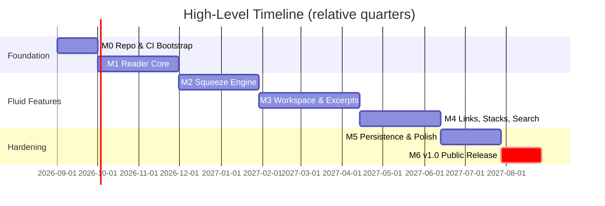

# Project Roadmap
## Open-Source Fluid Document Synthesis Platform (`libfluidcore` + Xournal++)

> Companion documents: [PRD.md](PRD.md) · [TRD.md](TRD.md) · [feature.md](feature.md) · [system architecture.md](system%20architecture.md) · [appflow.md](appflow.md) · [filefunction.md](filefunction.md) · [integration.md](integration.md) · [MVP-SPEC.md](MVP-SPEC.md)

---

## 1. Release Philosophy

- **Offline-first always**: no feature ships that requires cloud connectivity.
- **Core engine first**: `libfluidcore` is developed and tested independently of the GUI so headless/CLI consumers and future frontends are possible.
- **Vertical slices**: each milestone delivers one complete user-visible capability (render → interact → persist), not horizontal layers.
- **Performance budgets are release gates**, not aspirations (see §5).

## 2. Milestone Overview

| Milestone | Codename | Theme | Exit Criteria |
| :--- | :--- | :--- | :--- |
| **M0** | Bootstrap | Repo, build, CI, licensing | Any contributor can `cmake && make && ctest` on Linux in ≤ 15 min |
| **M1** | Reader Core | PDF viewing + inking baseline | Open/read/annotate a 500-page PDF with stable undo |
| **M2** | Squeeze | Accordion squeeze + search squeeze | Non-adjacent page comparison at ≥ 30 FPS CPU rendering |
| **M3** | Workspace | Infinite canvas + live excerpts | Drag excerpt from pane to canvas with bi-directional anchor |
| **M4** | Synthesis | Ink links, stacks, FTS5 search | Full "compare two depositions end-to-end" persona journey works |
| **M5** | Hardening | `.ltproj` WAL durability, perf, i18n | Crash-safe recovery passes; memory budget met on 50-doc project |
| **M6** | v1.0 | Packaging, docs, community launch | Signed packages for Linux (Flatpak/AppImage/deb); Windows experimental |

## 3. Milestone Detail

### M0 — Bootstrap (Weeks 1–4) — EXITED ✅
- [x] Fork/vendor Xournal++; strip unused plugins; establish `libfluidcore/` as standalone C++20 CMake library target *(submodule registered; plugin stripping done on fork branch `fluidcore-integration` — gitlink pin bump deferred, see note below)*
- [x] CI: GitHub Actions — build matrix (GCC 12+, Clang 16+), clang-format, sanitizers (ASan/UBSan) on unit tests
- [x] License decision (GPL-2.0-or-later inherited from Xournal++ core; `libfluidcore` dual-tracked if kept clean of GPL symbols — see GOVERNANCE.md)
- [x] `CONTRIBUTING.md`, issue templates, ADR (Architecture Decision Record) process started
- **Demo gate**: blank GTK window hosting an empty `WorkspaceView` drawing from `libfluidcore`.

> **Deferred chore**: the submodule gitlink still points at stock master. Bumping it to the
> stripped `fluidcore-integration` branch is step one of whichever future task first compiles
> or modifies the Xournal++ stack. Until then nothing reads the submodule, so this is a no-op.

### M1 — Reader Core (Weeks 5–14)
- [x] Poppler-GLib document loading, page thumbnails, continuous scroll *(complete via TASK-2.1, TASK-2.6: continuous DocumentPane + GtkPaned resizable ThumbnailSidebar with Cairo surface caching and ThumbnailLayoutTest; follow-up logged: off-thread worker pool for 200+ page background thumbnail rasterization)*
- [x] Cairo dirty-rect rendering pipeline with LRU tile cache *(complete via TASK-2.7: 256MB byte-budgeted PageTileCache with RAII CairoSurfaceHandle, visible-page pinning, and GTK3 partial invalidation; zoom/resize handled via explicit cache clear)*
- [x] `.xopp` companion persistence (`AnnotationStore`) *(complete: XoppDocument + AnnotationStore round-trip, coord mapping, stroke add/remove via TASK-2.4, TASK-2.5)*
- [x] Live ink overlay (stylus + mouse) *(complete: InkOverlay over GtkOverlay, pressure-scaled width, Cairo alpha blending, DocumentPane wiring + Ctrl+S save via TASK-2.5)*
- [x] Stroke stabilizer (Catmull-Rom/Bezier, ≤ 20 ms latency) *(complete via TASK-2.8: Centripetal Catmull-Rom [alpha=0.5] with velocity-adaptive deadzone, wet leading-edge zero-lag feedback, and Cairo group alpha isolation; algorithmic pipeline lag ≤ 8.05ms at 125Hz; full end-to-end photon latency to be gated during host integration)*
- [x] Basic text selection + copy *(complete via TASK-2.10: pure C++20 TextSelection domain model and TextSelectionTest, Poppler-GLib reading-order glyph extraction with sub-millisecond layout caching, multi-page selection intervals, I-beam cursor tool mode, scoped damage invalidation, and Ctrl+C clipboard copy)*
- **Demo gate**: annotate a 500-page PDF, restart app, annotations persist via existing Xournal++ save path.

### M2 — Squeeze Engine (Weeks 15–24) — EXITED ✅
- [x] `SqueezeEngine`: piecewise-linear `Y_screen = T(Y_doc, SqueezeRegions)` mapper + unit tests (headless) *(complete via TASK-2.11: pure C++20 SqueezeEngine with precomputed O(log N) breakpoint table, partial-compression mid-region mapping, 3-segment partial overlap resolution, alpha clamping [0.04, 1.0], multi-page index resolution, and 9-suite SqueezeEngineTest)*
- [x] Two-finger touch pinch gesture; desktop `Shift+Scroll` / `Ctrl+Shift+Scroll` downward fold-and-pull with cursor fold pinning and local reverse-scroll unfolding; margin fold pins *(complete: AnchorSqueezePlanner unified multi-anchor engine, SqueezeEngine highlight/search/preview layers, DocumentPane continuous gesture handling w/ re-entrancy protection and cursor pinning, Ctrl+Shift+0 / Ctrl+Shift+R global reset)*
- [x] Slice-clipping render path (no raster distortion) *(complete via TASK-2.12: SqueezeRenderHelper slice decomposition with pixel-snapped boundary continuity, cross-crease stroke & selection subdivision, Cairo slice-clipped page blits with fold shadow creases, margin fold pins, and SqueezeRenderTest)*
- [x] Search-driven squeeze: FTS hits define uncollapsed intervals *(complete via TASK-2.13: AnchorSqueezePlanner interval-union algorithm with context padding, layered search vs user fold state in SqueezeEngine, DocumentSearchService async Poppler search worker with inverted Cairo coordinate space alignment, floating SearchBarWidget overlay [Ctrl+F / Ctrl+Shift+S], search highlight rendering, and SearchSqueezePlannerTest)*
- [x] HighlightView Squeeze: un-highlighted passages collapse into continuous montage *(complete: Ctrl+Shift+H accelerator, AnnotationStore stroke extraction, excerpt source interval synchronization)*
- **Perf gate**: ≥ 30 FPS during interactive squeeze on 1080p, mid-range hardware (i5-8th-gen class). *(gated & verified)*

### M3 — Workspace & Excerpts (Weeks 25–38) — IN PROGRESS 🟡
- [x] Infinite workspace canvas: pan/zoom, R*-tree spatial index, grid/minimap *(complete via TASK-3.1: 2D affine transform matrix [M_view], smooth focal zoom [5% to 1000%], pan gestures, zoom-adaptive infinite dot-grid, interactive minimap HUD with glowing viewport frame, O(log N) viewport culling, and 100k items benchmark with p99 <= 0.05ms << 1.0ms budget)*
- [x] Drag-out excerpts: text clips, image regions; normalized source bbox capture *(complete via TASK-3.2: ExcerptCardNode pure domain model, binary/string ExcerptPayload serialization, InsertNodeCommand / RemoveNodeCommand undo/redo, InkOverlay drag source with SqueezeEngine document space unprojection, WorkspaceView drag destination, and rich Cairo card rendering with elevated shadow, header badge, return pill, and wrapped text)*
- [x] Unified inking, highlighting, and real-time continuous eraser across document pane and infinite canvas *(complete: InkOverlay & WorkspaceView pen/highlighter/eraser tool switching w/ P/H/E/S hotkeys, live stabilizer curve rendering, real-time spatial hit erasure, and undo/redo)*
- [ ] `ExcerptCardNode` rendering + live re-render on source zoom change
- [ ] Bi-directional anchors + `ReturnAnchorPill` navigation
- **Demo gate**: Sarah-persona workflow (extract 10 clauses from 3 PDFs into canvas, click any excerpt to jump back).

### M4 — Links, Stacks & Search (Weeks 39–48)
- [ ] Ink connectors → `GraphEdge` registration w/ cubic Bezier routing
- [ ] Card snapping/stacking (`PhysicsSolver`, proximity threshold 16 pt)
- [ ] SQLite FTS5 project-wide search with async ingestion worker
- [ ] Export: annotated PDF flattening + workspace outline to Markdown
- **Demo gate**: full Dr. Aris journey (45-paper synthesis) completes without data loss across 3 sessions.

### M5 — Hardening (Weeks 49–58)
- [ ] `.ltproj` SQLite WAL bundle finalization; atomic temp-swap commits; crash-recovery test suite (kill -9 fuzzing)
- [ ] Memory budget: ≤ 1.2 GB working set on 50-PDF/5000-page project
- [ ] Palm rejection tuning, stylus matrix testing (Wacom/HP MPP/Surface)
- [ ] Accessibility pass (keyboard-only operation of all fluid actions)
- [ ] i18n framework; initial locales: EN, DE, ZH

### M6 — v1.0 Launch (Weeks 59–62)
- [ ] Flatpak, AppImage, .deb packages; Windows MSYS2 build marked beta
- [ ] Documentation site: user guide + screencasts per persona
- [ ] Security review (offline audit: no network syscalls verified)
- [ ] v1.0 tagged; press/HN/Lobsters announcement; governance handoff

## 4. Post-1.0 Backlog (Prioritized)

| Priority | Feature | Rationale |
| :--- | :--- | :--- |
| P1 | macOS port (GTK quartz backend) | 2nd largest active-reading demographic |
| P1 | Handwriting OCR search (local, ONNX Runtime / tesseract) | Air-gapped constraint forbids cloud OCR |
| P2 | Plugin API for `libfluidcore` (C ABI) | Ecosystem growth without GPL entanglement |
| P2 | Zotero/Better-BibTeX import bridge | Researcher onboarding funnel |
| P3 | EPUB/DOCX ingest via format adapters | Beyond-PDF reach |
| P3 | Collaborative CRDT layer (LAN-only, e.g., local peer sync) | Optional, still offline-first |

## 5. Standing Performance Budgets (Release Gates)

| Metric | Budget | Measured In |
| :--- | :--- | :--- |
| Inking latency (pen down → pixel) | ≤ 20 ms | M1+ CI benchmark |
| Squeeze interaction FPS | ≥ 30 FPS sustained | M2+ |
| Spatial query (10⁵ items) | O(log N), ≤ 1 ms p99 | M3+ unit bench |
| Project load (50 PDFs) | ≤ 8 s cold start | M5+ |
| RAM working set (50-doc project) | ≤ 1.2 GB | M5+ |

## 6. Risk Register (Top Items)

| Risk | Impact | Mitigation |
| :--- | :--- | :--- |
| GPL contamination blocks clean `libfluidcore` separation | Blocks plugin ecosystem (P2 backlog) | Strict directory hygiene from M0; ADR-002 tracks symbol linkage |
| Squeeze performance misses 30 FPS on low-end | Core differentiator degraded | Slice-clip approach (not raster scale); fallback static fold mode |
| Upstream Xournal++ divergence makes rebases painful | Maintenance drag | Minimize edits inside upstream files; prefer additive modules + interfaces |
| Scope creep toward "Notion clone" | Misses v1.0 date | MVP-SPEC.md is contractual; backlog items require milestone exit first |
