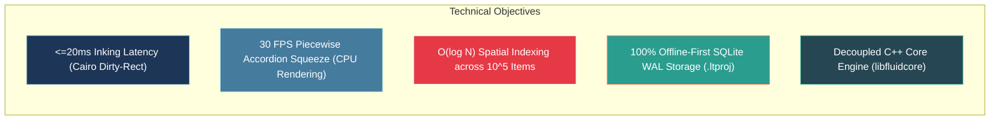

# Technical Requirements Document (TRD)
## Offline Fluid Document Synthesis Engine (Decoupled Core + Desktop Architecture)

---

## 1. Project Purpose & Technical Objectives

### 1.1 Project Purpose
The purpose of this project is to engineer an **Offline-First Fluid Document Synthesis Engine** that eliminates the cognitive friction of active reading and cross-document analysis. The system combines a **non-linear malleable document viewer** with an **infinite 2D associative workspace**, enabling instantaneous side-by-side comparison (via accordion squeeze and margin fold pins), bi-directional source-anchored excerpting, low-latency vector inking, and graph-based visual linking.

The architecture is structured around a **Decoupled C++20 Core Engine (`libfluidcore`)** consumed by a **cross-platform GTK 3 / Cairo / Poppler desktop frontend** (extending Xournal++). This guarantees modularity, independent unit testability of spatial and graph algorithms, air-gapped security, zero cloud dependency, and deterministic sub-millisecond interaction calculations.



### 1.2 Core Engineering Challenges
1. **Dynamic Non-Linear Layout Deformation**: Computing real-time continuous vertical accordion coordinate folding ($Y_{screen} \leftrightarrow Y_{doc}$) at 60 FPS without reflowing or re-rasterizing underlying vector PDF pages.
2. **Decoupled Bi-Directional Graph Topology**: Maintaining unbreakable referential integrity between immutable PDF source coordinates, extracted visual excerpt cards, nested topic stacks, and elastic visual ink connectors inside `libfluidcore`.
3. **Dual Input Architecture**: Processing high-frequency digitizer interrupts and touch gestures while providing first-class keyboard/mouse desktop controls (`Ctrl+Shift+Scroll` squeeze, margin fold pins, `Shift/Space-hold` peeking).
4. **Memory-Virtualization of Multi-Gigabyte Projects**: Managing projects containing 50+ high-resolution PDFs (5,000+ pages) within a strict $\le 1.2\text{GB}$ RAM working set via two-tier tile caching and asynchronous worker pools.

---

## 2. Functional Requirements (Technical Architecture Mapping)

| Functional Capability | Responsible Subsystem | Technical Implementation Mechanism |
| :--- | :--- | :--- |
| **Pinch & Desktop Squeeze** | `FluidCore::SqueezeEngine` | Piecewise-linear virtual coordinate transformation $Y_{screen} = \mathcal{T}(Y_{doc}, \mathbf{SqueezeRegions})$. Squeeze $\alpha$ drives slice clipping (revealing content) rather than vertical raster scaling, avoiding text distortion. |
| **Search / Highlight Squeeze** | `Layout Engine` + `FTS5 Index` | Query hit bounding boxes define uncollapsed slice intervals; intermediate intervals collapsed to zero height or accordion creases. |
| **Excerpt Drag & Drop** | `Spatial & Excerpt Manager` | Captures normalized PDF bounding box $[x_0, y_0, x_1, y_1]$, page index, doc UUID, extracts text/raster tile, and instantiates an `ExcerptCardNode` via GTK3 DND. |
| **Bi-Directional Anchor Navigation** | `Graph & Link Subsystem` | Tapping anchor triggers camera trajectory interpolation in Document Pane: $\mathbf{Pos}_{target} = \mathcal{F}(DocUUID, PageIdx, Rect)$ with persistent `ReturnAnchorPill`. |
| **Live Ink Links / Connectors** | `FluidCore::GraphTopology` | Stroke hit-tests against existing node bounds; if endpoints intersect Node $A$ and Node $B$, a directed `GraphEdge` is registered with dynamic cubic Bezier routing. |
| **Card Snapping & Stacking** | `FluidCore::PhysicsSolver` | Spatial proximity test ($\Delta r \le 16\text{pt}$); creates compound `CardStackNode` with collapsible child node tree. |
| **Full-Text Project Search** | `FluidCore::SearchEngine` | Embedded SQLite FTS5 index with custom Unicode tokenizer and asynchronous background worker ingestion. |
| **Offline Persistence & Recovery** | `FluidCore::ProjectStore` | Structured `.ltproj` bundle with SQLite WAL (Write-Ahead Logging), memory-mapped files, and atomic temp-swap commits. |

---

## 3. System Architecture & High-Level Module Breakdown

```mermaid
graph TB
    subgraph Hardware & OS Input Layer
        HW_PEN["Active Stylus / Digitizer"]
        HW_TOUCH["Capacitive Multi-Touch Screen"]
        HW_DESKTOP["Keyboard & Mouse (Ctrl+Shift+Scroll / Margin Pins)"]
        HW_STORAGE["Local NVMe / SSD Storage"]
    end

    subgraph Frontend Input & UI Shell (GTK 3 / Cairo)
        IN_CTX["InputContext / Device Router"]
        GESTURE_SM["Gesture Recognizer (Touch Pinch / Pan)"]
        DESKTOP_CTRL["Desktop Squeeze & Peek Controller"]
        DOC_VIEW["Squeezed Document Viewport (XojPageView / Cairo)"]
        WS_VIEW["Infinite Workspace Viewport (WorkspaceView / Cairo)"]
        SPLIT_MGR["Dual-Pane Splitter (GtkPaned Container)"]
        RETURN_PILL["Floating Return Anchor Pill Manager"]
    end

    subgraph Decoupled Core Engine (libfluidcore / C++20)
        API_GATEWAY["FluidCore C++ API Interface"]
        SQUEEZE_MATH["Piecewise Coordinate Mapper T(Y)"]
        SPATIAL_RTREE["R*-Tree 2D Spatial Index"]
        GRAPH_TOPOLOGY["Bi-Directional Graph Model G=(V,E)"]
        BEZIER_ROUTER["Dynamic Cubic Bezier Spline Solver"]
        PHYSICS_SNAP["Magnetic Snapping & Stacking Physics"]
        SEARCH_FTS["SQLite FTS5 Query Engine"]
        PROJECT_STORE["SQLite WAL Transaction Manager"]
    end

    subgraph Document Rendering & Storage Layer
        POPPLER_CORE["Poppler GLib PDF & Glyph Extraction Engine"]
        TILE_CACHE["2-Tier Virtual ARGB32 Tile Cache (LRU)"]
        SQLITE_DB["Embedded SQLite 3 DB (project.db + WAL)"]
        ASSET_VAULT["Local Immutable Document & Clip Vault"]
    end

    %% Wiring
    HW_PEN --> IN_CTX
    HW_TOUCH --> IN_CTX
    HW_DESKTOP --> IN_CTX

    IN_CTX --> GESTURE_SM
    IN_CTX --> DESKTOP_CTRL
    GESTURE_SM --> SQUEEZE_MATH
    DESKTOP_CTRL --> SQUEEZE_MATH

    SQUEEZE_MATH --> DOC_VIEW
    POPPLER_CORE --> TILE_CACHE
    TILE_CACHE --> DOC_VIEW

    WS_VIEW <--> API_GATEWAY
    DOC_VIEW <--> API_GATEWAY

    API_GATEWAY --> SPATIAL_RTREE
    API_GATEWAY --> GRAPH_TOPOLOGY
    API_GATEWAY --> BEZIER_ROUTER
    API_GATEWAY --> PHYSICS_SNAP
    API_GATEWAY --> SEARCH_FTS
    API_GATEWAY --> PROJECT_STORE

    PROJECT_STORE --> SQLITE_DB
    POPPLER_CORE --> ASSET_VAULT
    PROJECT_STORE --> HW_STORAGE

    style HW_PEN fill:#264653,color:#ffffff
    style HW_TOUCH fill:#264653,color:#ffffff
    style HW_DESKTOP fill:#264653,color:#ffffff
    style API_GATEWAY fill:#1d3557,color:#ffffff
    style SQUEEZE_MATH fill:#457b9d,color:#ffffff
    style GRAPH_TOPOLOGY fill:#e63946,color:#ffffff
    style SPATIAL_RTREE fill:#2a9d8f,color:#ffffff
    style SQLITE_DB fill:#e76f51,color:#ffffff
```

---

### 3.1 Input & Gesture Processing Subsystem
* **Pointer Classification**: Routes incoming GTK/GDK events into distinct semantic streams:
  * `INPUT_DEVICE_PEN`: Dispatched with minimal queue delay directly to the active `StrokeHandler`.
  * `INPUT_DEVICE_TOUCHSCREEN`: Filtered through `HandRecognition`; multi-point touches dispatched to `TouchInputHandler` (Pinch, Pan, Squeeze).
  * `INPUT_DEVICE_MOUSE`: Dispatched to mouse handlers with modifier checks:
    * `Ctrl + Shift + Mouse Wheel`: Squeezes/expands document accordion at cursor Y coordinate.
    * `Shift + Drag` or `Space + Skim`: Triggers Bookmark Peeking (`beginPeek()`), snapping back on release (`endPeek()`).
    * `Margin Pin Drag`: Adjusts specific squeeze crease boundaries.
* **Squeeze Gesture Detector**: Tracks two concurrent touch points $(P_1, P_2)$ on the Document Viewport. Primary axis check (resolution/DPI-independent): the vertical distance $|P_{1y} - P_{2y}|$ shrinks with an angular deviation $\le 25^\circ$ from the vertical axis, triggering `EVENT_SQUEEZE_START`. Pixel-delta thresholds (e.g. $>40\text{px}$ combined travel, minimal horizontal drift) are used only as a minimum-movement noise filter against accidental micro-jitter — never as the axis test.

### 3.2 Dynamic Document Layout & Squeeze Engine (`libfluidcore`)
* **Non-Linear Coordinate Transformation**: Translates absolute document vertical coordinates $Y_{doc}$ to viewport screen coordinates $Y_{screen}$.
$$\mathcal{T}(Y_{doc}) = Y_{doc} - \sum_{i=1}^{k} \max\left(0, \min(H_i, Y_{doc} - S_{i,start})\right) \cdot (1 - \alpha_i)$$
Where:
  * $S_{i,start}, S_{i,end}$: Boundary coordinates of the $i$-th squeezed region.
  * $H_i = S_{i,end} - S_{i,start}$: Original uncompressed height.
  * $\alpha_i \in [0.0, 1.0]$: Accordion compression factor. To prevent severe text distortion during animation, $\alpha_i$ does **not** scale the raster vertically. Instead, it drives the clipping boundary size and the procedural crease shadow opacity.
* **Accordion Crease Rendering**: Renders a procedural 3D pleated shadow gradient across collapsed boundaries using Cairo linear patterns, providing realistic tactile feedback of folded paper.

### 3.3 PDF & Vector Document Rendering Subsystem
* **Engine Core**: Poppler GLib library encapsulated in a C++ thread-safe wrapper.
* **Tile-Based Virtual Rasterization**: Divides each visible page into $512 \times 512\text{px}$ tiles rendered asynchronously on worker threads.
* **Glyph & Text Boundary Extraction**: Computes normalized vector bounding boxes for every character, word, and paragraph upon document load for instantaneous hit-testing and lasso selection.

### 3.4 Workspace Canvas & Spatial Indexing Subsystem
* **Infinite Viewport Coordinate Space**: Maintains a 2D affine transformation matrix:
$$\mathbf{M}_{view} = \begin{bmatrix} s & 0 & t_x \\ 0 & s & t_y \\ 0 & 0 & 1 \end{bmatrix}$$
* **Two-Tier R-Tree Spatial Indexing**:
  * **Live In-Memory Index**: An $O(\log N)$ R*-Tree (Boost.Geometry `rtree`) indexes the axis-aligned bounding boxes (AABB) of all workspace nodes, excerpts, sticky notes, and ink strokes during interactive dragging/panning, before anything is persisted. Enables sub-millisecond viewport culling across $100{,}000+$ objects.
  * **Persisted On-Disk Index**: SQLite's built-in R-Tree module maintains a spatial index over saved `.ltproj` node bounds for fast spatial queries on project reopen, rebuilt incrementally as nodes are committed.
* **Physics & Snapping Solver**: Computes vector attraction forces when moving cards enter the $\Delta r \le 16\text{pt}$ halo of adjacent card edges.

### 3.5 Graph & Bi-Directional Link Subsystem
* **Data Model**: Directed Multi-Graph $G = (V, E)$ managed in `libfluidcore`.
  * **Vertices $V$** (runtime classes map 1:1 to the `workspace_nodes.node_type` DB enum): `TextExcerptNode` (`TEXT_EXCERPT`), `ImageClipNode` (`IMAGE_CLIP`), `StickyNoteNode` (`STICKY_NOTE`), `TextBoxNode` (`TEXT_BOX`), and `CardStackNode` (persists as a `STACK_HEADER` node row; child cards reference it via `parent_stack_id`). Document anchors are not standalone vertices; they are stored in `source_anchors` and attached to excerpt nodes.
  * **Edges $E$** (runtime classes map to `graph_edges.edge_type` + `edge_kind`): `SourceOriginEdge` (`MANUAL_LINK` with `edge_kind='SOURCE_ORIGIN'`, bi-directional source link backed by the `source_anchors` table), `ElasticInkLinkEdge` (`INK_LINK`, relational ink connector), `HierarchyParentEdge` (`HIERARCHY`, nested stack structure).
* **Camera Trajectory Interpolator**: Executes smooth minimum-jerk spline animation curves ($t \in [0, 1]$) when navigating between graph nodes across documents and workspace coordinates.

### 3.6 Low-Latency Vector Inking Engine
* **Curve Fitting**: Converts raw sampled stylus points $(x, y, p, t)$ into smooth parametric curves using `StrokeStabilizer` (Inertia, Velocity Gaussian, Deadzone).
* **Pressure-to-Thickness Mapping**: Evaluates line width $w(p) = w_{min} + (w_{max} - w_{min}) \cdot p^\gamma$, where $\gamma \approx 1.2$ for natural ink feel.
* **Cairo Stroke Composition**: Renders transient segments to an overlay Cairo surface with dirty-rect invalidation (`gtk_widget_queue_draw_area`), baking completed strokes into the background page buffer.

---

## 4. Integration Points & Core/Frontend Boundary

```mermaid
graph LR
    subgraph Frontend Subsystem (GTK 3 / Cairo / Poppler)
        GTK_WIN["MainWindow / GtkPaned Container"]
        DOC_PANE["Document Viewport (XournalView / Cairo)"]
        WS_PANE["Workspace Viewport (WorkspaceView / Cairo)"]
        POPPLER["Poppler GLib Integration"]
    end

    subgraph Core Engine Interface (FluidCoreAPI)
        FC_LAYOUT["Squeeze Layout & Coordinate Transform"]
        FC_GRAPH["Graph Traversal & Node Registry"]
        FC_SPATIAL["R*-Tree Spatial Range Queries"]
        FC_STORE["SQLite WAL Persistence & FTS5"]
    end

    GTK_WIN <-->|Dual Viewport Coordination| FC_LAYOUT
    DOC_PANE <-->|Coordinate Mapping T(Y)| FC_LAYOUT
    WS_PANE <-->|Spatial Culling & Hit Tests| FC_SPATIAL
    WS_PANE <-->|Edge Routing & Snapping| FC_GRAPH
    POPPLER -->|Glyph Bounding Boxes| FC_STORE

    style GTK_WIN fill:#1d3557,color:#ffffff
    style DOC_PANE fill:#457b9d,color:#ffffff
    style WS_PANE fill:#2a9d8f,color:#ffffff
    style FC_GRAPH fill:#e63946,color:#ffffff
```

### 4.1 C++ `FluidCoreAPI` Interface Contract
```cpp
namespace FluidCore {

struct PageGeometry {
    size_t pageIndex;
    double widthPt;
    double heightPt;
    double unscaledYOffset;
};

class FluidCoreAPI {
public:
    virtual ~FluidCoreAPI() = default;

    // Document Geometry & Squeeze Layout API (Pure C++ - No Poppler/GTK Dependencies)
    virtual void registerDocumentGeometry(const std::string& docId, const std::vector<PageGeometry>& pages) = 0;
    virtual CoordinateTransformResult mapDocumentYToScreen(double docY, const std::string& docId) const = 0;
    virtual CoordinateTransformResult mapScreenYToDocument(double screenY, const std::string& docId) const = 0;
    virtual void setSqueezeRegion(const std::string& docId, double yStart, double yEnd, double alpha) = 0;
    virtual void resetSqueeze(const std::string& docId) = 0;

    // Spatial Scene Graph API (UUID-based Identifiers matching SQLite Schema)
    virtual std::string insertNode(std::unique_ptr<WorkspaceNode> node) = 0;
    virtual void updateNodePosition(const std::string& nodeId, double x, double y) = 0;
    virtual void removeNode(const std::string& nodeId) = 0;
    virtual std::vector<WorkspaceNode*> queryVisibleNodes(const Rectangle& viewportBounds) const = 0;

    // Pure Geometry Exposure Contract: libfluidcore never receives or returns Cairo/GTK types.
    // The frontend reads geometry (bounds, positions, spline control points via getEdgeGeometry)
    // and performs ALL rendering in the GTK/Cairo layer. Core classes expose no render methods.
    virtual Rectangle getNodeBounds(const std::string& nodeId) const = 0;
    virtual Point getNodePosition(const std::string& nodeId) const = 0;

    // Bi-Directional Relational Graph & Live Ink Link API
    virtual std::string createInkLink(const std::string& sourceNodeId, const std::string& targetNodeId, const Color& color) = 0;
    virtual BezierSpline getEdgeGeometry(const std::string& edgeId) const = 0;
    virtual std::vector<std::string> getConnectedEdges(const std::string& nodeId) const = 0;

    // Persistence & Search API
    virtual void openProject(const std::string& ltprojDirectoryPath) = 0;
    virtual void saveProject() = 0;
    virtual std::vector<SearchResult> executeSearch(const std::string& query) const = 0;
};

} // namespace FluidCore
```

---

## 5. Resource Management & Performance Baseline Rules

### 5.1 Latency & Framerate SLAs
* **Inking Latency**: $\le 20\text{ms}$ on standard desktop digitizers via Cairo transient mask composition and dirty-rectangle damage coalescing.
* **Render Frame Budget**: $\le 33.3\text{ms}$ (30 FPS baseline). Squeeze layout coordinate calculations execute in $<2.5\text{ms}$ per frame.
* **Spatial Query Latency**: R-Tree spatial range queries for visible viewport bounding box return in $<0.5\text{ms}$ for $N = 100,000$ nodes.

### 5.2 Memory & Cache Architecture
* **2-Tier Virtual Tile Cache**:
  * **L1 Cache (Active Viewport RAM)**: Uncompressed 32-bit ARGB32 raster tiles for the currently visible viewport + 1 screen buffer margin (approx. $128\text{MB}$ to support 4K viewports).
  * **L2 Cache (Retained RAM Pool)**: Retained surfaces for adjacent and recently viewed pages, managed as a dynamic $256\text{MB}$–$384\text{MB}$ pool with strict Least-Recently-Used (LRU) eviction.
* **RAM Footprint Constraints**:
  * Idle (1 document, 100 pages): $\le 120\text{MB}$ RSS.
  * Active (10 documents, 1,000 pages, 200 excerpts): $\le 500\text{MB}$ RSS.
  * Extreme Project (50 documents, 5,000 pages, 2,000 excerpts): $\le 1.2\text{GB}$ RSS.

---

## 6. Local Storage, Database Schema & File Bundle

### 6.1 Compound Local Archive (`.ltproj`) Structure
During active runtime sessions, `.ltproj` is mounted as an **uncompressed directory bundle** on the local filesystem to permit high-frequency, non-blocking SQLite WAL writes. For export, backup, or file sharing, `LtProjSaver` packages the directory into a compressed single-file `.ltproj.zip` archive using standard `libzip` DEFLATE compression for maximum interoperability.

> [!IMPORTANT]
> **WAL Safety on Packaging (Mandatory)**: Before archiving, `LtProjSaver` MUST run `PRAGMA wal_checkpoint(TRUNCATE)` so that `project.db-wal` is empty in the archive — shipping a stale `-wal` file alongside a checkpointed database produces corrupt exports. On import, `LtProjLoader` MUST verify WAL consistency and run a checkpoint again before rehydrating the workspace model.

```
[ProjectBundle.ltproj/] (Runtime Directory Bundle / Archive on Export)
├── project.db                   # Main SQLite 3.45+ Database (WAL enabled)
├── project.db-wal               # Active Write-Ahead Log (Sub-500ms debounce against process crashes)
├── project.db-shm               # SQLite Shared Memory Index
├── metadata.json                # Project manifest, schema version, creation info
├── /documents/                  # Immutable Source Document Storage
│   ├── {doc_uuid_1}.pdf
│   └── {doc_uuid_2}.pdf
├── /assets/                     # Raster Clips & User Images
│   ├── /clips/{clip_uuid}.png
│   └── /images/{img_uuid}.png
└── /cache/                      # Rebuildable Thumbnails & Tile Previews
    └── /thumbnails/{doc_uuid}/p_{page_idx}.webp
```

### 6.2 SQLite Database Relational Schema (DDL)

```sql
-- Core Project Metadata
CREATE TABLE projects (
    project_id TEXT PRIMARY KEY NOT NULL,
    title TEXT NOT NULL,
    created_at INTEGER NOT NULL,
    updated_at INTEGER NOT NULL,
    schema_version INTEGER NOT NULL DEFAULT 1
);

-- Documents Registered in the Project
CREATE TABLE documents (
    doc_id TEXT PRIMARY KEY NOT NULL,
    project_id TEXT NOT NULL REFERENCES projects(project_id) ON DELETE CASCADE,
    filename TEXT NOT NULL,
    file_path_relative TEXT NOT NULL,
    file_sha256 TEXT NOT NULL,
    page_count INTEGER NOT NULL,
    file_size_bytes INTEGER NOT NULL,
    created_at INTEGER NOT NULL
);

-- Excerpt & Workspace Nodes
CREATE TABLE workspace_nodes (
    node_id TEXT PRIMARY KEY NOT NULL,
    project_id TEXT NOT NULL REFERENCES projects(project_id) ON DELETE CASCADE,
    node_type TEXT NOT NULL CHECK(node_type IN ('TEXT_EXCERPT', 'IMAGE_CLIP', 'STICKY_NOTE', 'TEXT_BOX', 'STACK_HEADER')),
    pos_x REAL NOT NULL,
    pos_y REAL NOT NULL,
    width REAL NOT NULL,
    height REAL NOT NULL,
    z_index INTEGER NOT NULL DEFAULT 0,
    parent_stack_id TEXT REFERENCES workspace_nodes(node_id) ON DELETE SET NULL,
    created_at INTEGER NOT NULL,
    updated_at INTEGER NOT NULL
);

-- Document Source Anchors (Bi-Directional Deep Links, Multi-Source Synthesis Enabled)
CREATE TABLE source_anchors (
    anchor_id TEXT PRIMARY KEY NOT NULL,
    node_id TEXT NOT NULL REFERENCES workspace_nodes(node_id) ON DELETE CASCADE,
    doc_id TEXT NOT NULL REFERENCES documents(doc_id) ON DELETE CASCADE,
    page_index INTEGER NOT NULL,
    rect_x0 REAL NOT NULL,
    rect_y0 REAL NOT NULL,
    rect_x1 REAL NOT NULL,
    rect_y1 REAL NOT NULL,
    raw_text_content TEXT,
    highlight_color INTEGER DEFAULT NULL
);
CREATE INDEX idx_source_anchors_node ON source_anchors(node_id);
CREATE INDEX idx_source_anchors_doc ON source_anchors(doc_id, page_index);

-- Bi-Directional Graph Edges (Directed Source->Target Topology, Bi-Directional UI Navigation)
CREATE TABLE graph_edges (
    edge_id TEXT PRIMARY KEY NOT NULL,
    project_id TEXT NOT NULL REFERENCES projects(project_id) ON DELETE CASCADE,
    source_node_id TEXT NOT NULL REFERENCES workspace_nodes(node_id) ON DELETE CASCADE,
    target_node_id TEXT NOT NULL REFERENCES workspace_nodes(node_id) ON DELETE CASCADE,
    edge_type TEXT NOT NULL CHECK(edge_type IN ('INK_LINK', 'MANUAL_LINK', 'HIERARCHY')),
    edge_kind TEXT NOT NULL DEFAULT 'GENERIC', -- Sub-classification, e.g. 'SOURCE_ORIGIN' under MANUAL_LINK
    stroke_geometry_blob BLOB,
    color INTEGER NOT NULL,
    created_at INTEGER NOT NULL
);
CREATE INDEX idx_graph_edges_source ON graph_edges(source_node_id);
CREATE INDEX idx_graph_edges_target ON graph_edges(target_node_id);

-- Vector Ink Strokes
CREATE TABLE ink_strokes (
    stroke_id TEXT PRIMARY KEY NOT NULL,
    project_id TEXT NOT NULL REFERENCES projects(project_id) ON DELETE CASCADE,
    container_type TEXT NOT NULL CHECK(container_type IN ('DOCUMENT', 'WORKSPACE', 'NODE')),
    -- 'NODE': stroke belongs to a specific workspace node (container_ref_id = node_id),
    -- e.g. ink annotations drawn directly onto an excerpt card.
    container_ref_id TEXT NOT NULL,
    page_index INTEGER DEFAULT NULL,
    bounding_box_blob BLOB NOT NULL,
    points_blob BLOB NOT NULL,
    tool_type TEXT NOT NULL,
    color INTEGER NOT NULL,
    base_width REAL NOT NULL,
    created_at INTEGER NOT NULL
);

-- Tags and Semantic Categories
CREATE TABLE tags (
    tag_id TEXT PRIMARY KEY NOT NULL,
    project_id TEXT NOT NULL REFERENCES projects(project_id) ON DELETE CASCADE,
    tag_name TEXT NOT NULL,
    tag_color INTEGER NOT NULL,
    UNIQUE(project_id, tag_name)
);

CREATE TABLE entity_tags (
    tag_id TEXT NOT NULL REFERENCES tags(tag_id) ON DELETE CASCADE,
    entity_id TEXT NOT NULL,
    entity_type TEXT NOT NULL,
    PRIMARY KEY(tag_id, entity_id)
);

-- Full-Text Search Virtual Table (FTS5) - Unified Project Search
CREATE VIRTUAL TABLE fts_universal_index USING fts5(
    entity_id UNINDEXED,       -- Maps to doc_id OR workspace node_id OR tag_id
    entity_type UNINDEXED,     -- 'PDF_PAGE', 'TEXT_EXCERPT', 'STICKY_NOTE', 'TEXT_BOX',
                               -- 'IMAGE_CLIP' (via alt-text/OCR), 'TAG'
    page_index UNINDEXED,      -- Nullable for workspace nodes
    text_content,
    tokenize = 'unicode61 remove_diacritics 2'
);
```

### 6.3 Schema Migration & Versioning Strategy
1. **Version Tracking**: `projects.schema_version` stores the integer schema revision (v1 initial).
2. **Automated Migration Pipeline**: On `openProject()`, `ProjectStore` checks `schema_version`. If `schema_version < CURRENT_SUPPORTED_VERSION`, an explicit transactional migration script (`migrator_vN_to_vN+1.sql`) executes within a dedicated SQLite transaction before rehydrating the workspace model.
3. **Backup Guarantee**: An automatic snapshot `project.db.bak` is written prior to running migrations.

---

## 7. Dependencies and Native Libraries

| Component / Subsystem | Native Library & Dependency | Version / Standard | Technical Rationale |
| :--- | :--- | :--- | :--- |
| **Decoupled Core Engine** | ISO C++20 (`libfluidcore`) | C++20 | Deterministic zero-GC memory control, sub-millisecond graph and spatial queries, clean decoupling from GUI. |
| **PDF Rendering Core** | Poppler GLib | 22.02+ | Robust cross-platform PDF parsing, vector glyph extraction, and Cairo rendering integration. |
| **2D Graphics Pipeline** | Cairo 2D Graphics | 1.16+ | Native CPU vector graphics rasterization with dirty-rectangle damage tracking and sub-pixel antialiasing. |
| **UI Framework Shell** | GTK 3 (with custom GtkPaned) | 3.24+ | Mature cross-platform desktop UI toolkit with multi-device input routing. |
| **Database & Search Index** | SQLite3 with FTS5 & WAL | 3.45.0+ | Embedded zero-configuration ACID database with native inverted full-text search and WAL crash safety. |
| **Spatial Indexing (live, in-memory)** | R*-Tree Spatial Index | Boost.Geometry | $O(\log N)$ in-memory spatial range queries during interactive dragging/panning before persistence. |
| **Spatial Indexing (persisted)** | SQLite R*-Tree Module | SQLite 3.45+ (RTREE) | On-disk spatial index over saved `.ltproj` node bounds for fast queries on project reopen. |
| **DOCX Export Serialization** | pugixml | 1.13+ | Structured OOXML serialization for structured Word `.docx` outline export. |
| **Compression & Packaging** | `libzip` | DEFLATE / standard zip | Cross-platform compression for portable single-file `.ltproj.zip` archive packaging. |

---

*This concludes the comprehensive Technical Requirements Document (TRD).*
