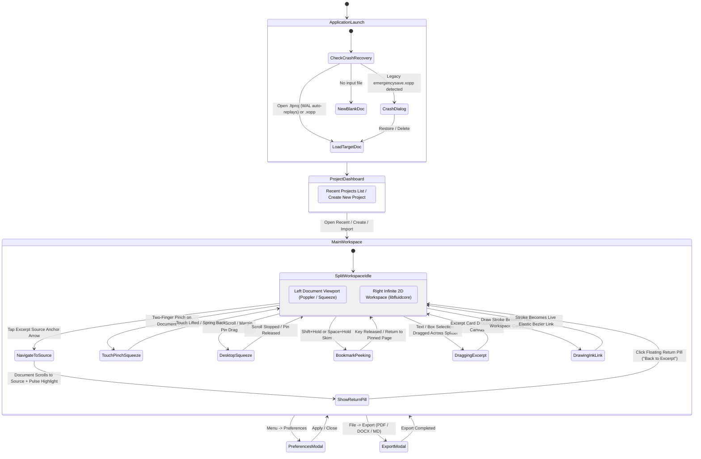
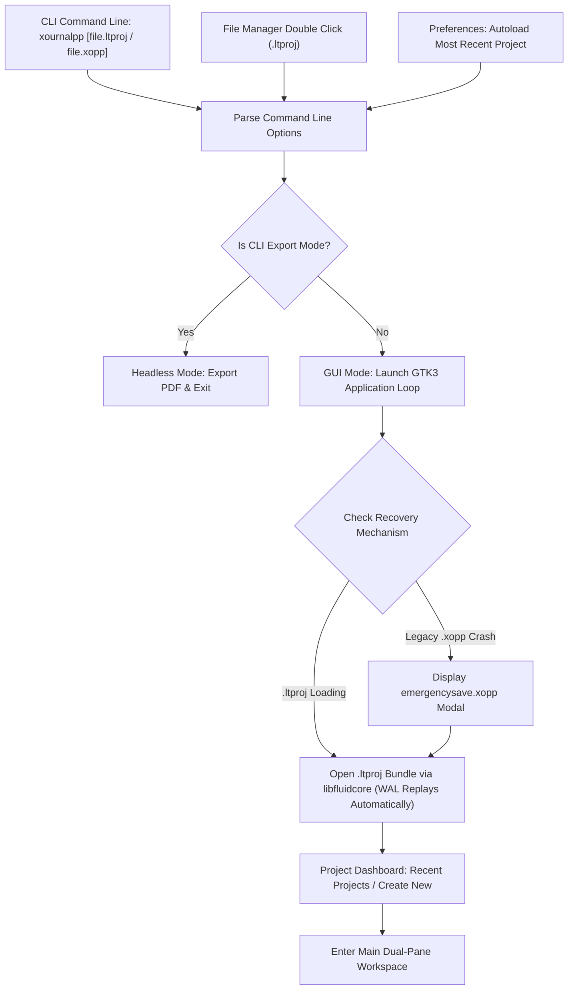
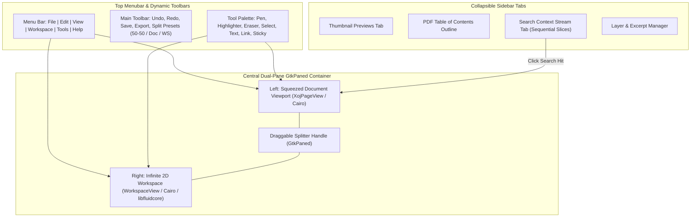
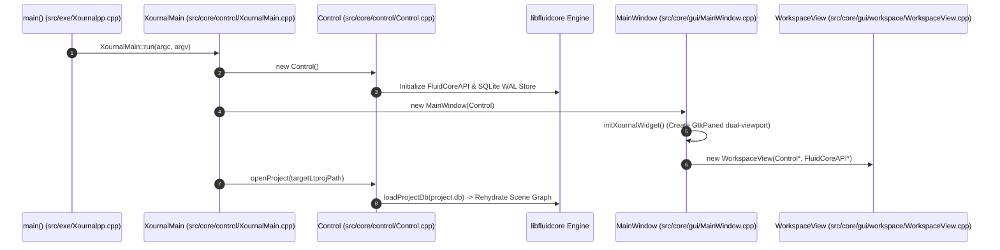
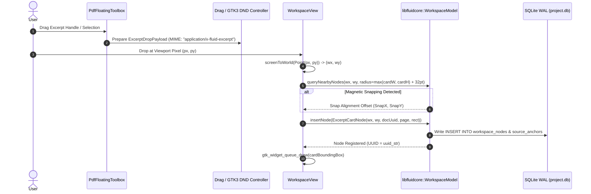
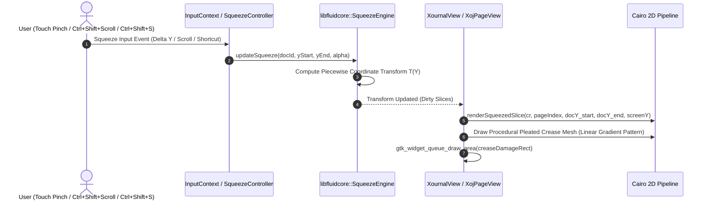
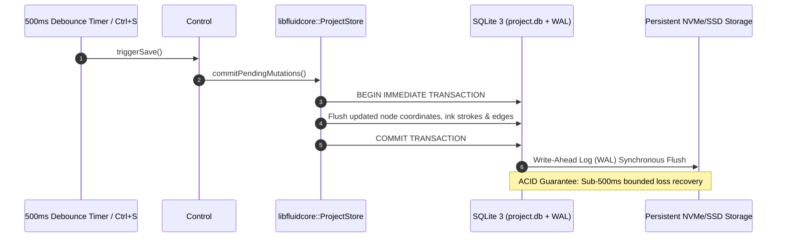

# Xournal++ & FluidCore AppFlow: User Journey & System Execution State Machines

This document specifies the step-by-step lifecycle and state transitions for both the **User Journey Flow (Screen-to-Screen UI interaction)** and the **System Execution Flow (Machine & Service interaction)** for Xournal++ augmented by the **Decoupled C++ Core Engine (`libfluidcore`)**.

---

# Part 1: User Journey Flow (Screen-to-Screen)

---

## 1. Entry Points & Project Launch Scenarios

1. **`.ltproj` Container Loading**: Opening a project mounts the local directory bundle `Project.ltproj/` (or unpacks `.ltproj.zip` if opening a compressed archive), initializes `libfluidcore::ProjectStore`, automatically replays any uncommitted transactions in the SQLite Write-Ahead Log (`project.db-wal`), and rehydrates the 2D infinite workspace scene graph.
2. **Crash Recovery Separation**: 
   - **Legacy `.xopp` files**: Rely on Xournal++'s legacy `emergencysave.xopp` XML dump mechanism.
   - **Modern `.ltproj` files**: Crash recovery is handled entirely transparently by the SQLite WAL upon database initialization. No recovery modal is shown because WAL replay guarantees sub-500ms bounds automatically.

---

## 2. Main Workspace Layout & Dual-Pane Navigation

---

## 3. Desktop & Touch Interaction Matrix

| User Action | Touch Interaction | Desktop Mouse / Keyboard Interaction | System Response |
|---|---|---|---|
| **Pinch-to-Squeeze** | Two-finger vertical pinch on document pane | `Ctrl + Shift + Mouse Wheel` at cursor Y position | Computes piecewise coordinate map $\mathcal{T}(Y_{doc})$; folds intermediate pages into pleated creases. |
| **Search Squeeze Toggle** | Pinch while search is active | Press `Ctrl + Shift + S` | Collapses non-matching text, displaying hits in sequence. |
| **Margin Fold Pin Drag** | Touch and drag margin pin handle | Click and drag margin pin handle | Adjusts specific fold boundaries interactively. |
| **Bookmark Peeking** | Hold one finger on page, skim with another | Hold `Shift` or `Space` while scrolling | Temporarily inspects distant pages (`beginPeek()`); releasing snaps back (`endPeek()`). |
| **Excerpt Drag & Drop** | Drag selected text/box across splitter | Click-and-drag selection across splitter | Instantiates `ExcerptCardNode` at drop coordinate $(X, Y)$ in `libfluidcore`. |
| **Back-Link Jump** | Tap source arrow on card | Click source arrow on card | Scrolls document to source bounding box with luminous pulse; displays floating return pill in viewport overlay. |
| **Return Pill Click** | Tap floating return pill | Click floating return pill | Glides infinite workspace viewport back to original excerpt card. |

---

# Part 2: System Execution Flow (Machine & Service Interaction)

---

## 1. Application Startup & `libfluidcore` Initialization

---

## 2. Excerpt Drag-and-Drop & Graph Edge Pipeline

---

## 3. Dynamic Accordion Squeeze Execution Pipeline

---

## 4. SQLite WAL Save & Crash-Safety Protocol

---

*This concludes the complete AppFlow specification for Xournal++ and libfluidcore.*
