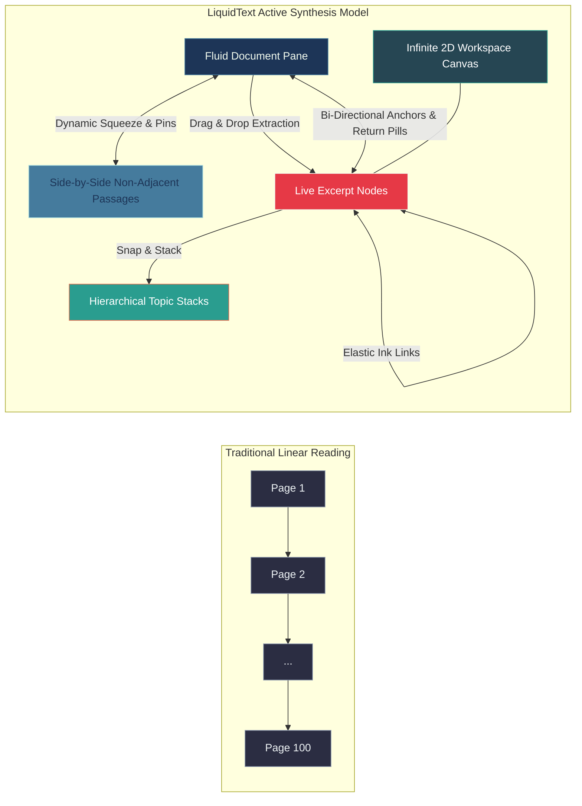
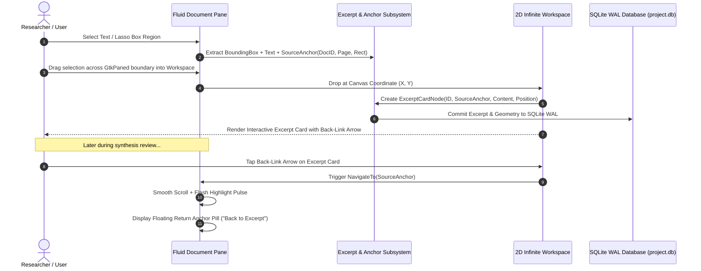
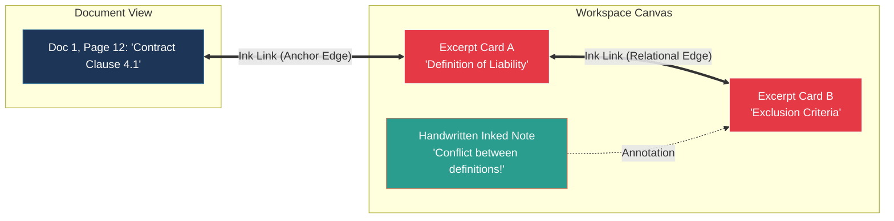
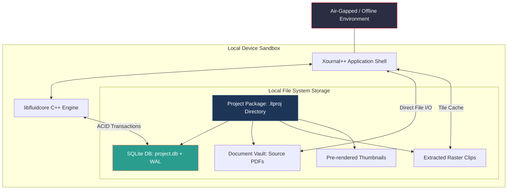

# LiquidText PDF: Comprehensive Feature & Interaction Specification

> **Focus**: Non-linear Active Reading, Spatial Document Synthesis, Multi-Document Projects, Dynamic Document Squeeze, Bi-Directional Linking, and 100% Offline-First Execution.

---

## 1. Core Mental Model & Philosophical Foundations

Traditional document readers (Adobe Acrobat, Preview, standard PDF viewers) replicate physical paper in a rigid, linear format: pages are stacked vertically or horizontally, annotations are locked inside margins, and cross-referencing distant pages requires tedious scrolling, tab switching, or memorizing page numbers.

**LiquidText** breaks this paradigm by treating documents as **fluid, malleable information substrates**. It is designed around the cognitive process of **Active Reading**—the analytical, critical process where readers highlight, extract, compare, synthesize, and structure knowledge across one or multiple documents simultaneously.



### Core Tenets of the LiquidText Model
1. **Fluid Representation**: Documents can compress, fold, accordion, and dynamically restructure without altering underlying source files.
2. **Context Preservation**: Every extracted piece of information (text clip, equation, chart, diagram) maintains an unbreakable bi-directional thread back to its exact origin in the source document.
3. **Spatial Synthesis**: The workspace provides an infinite, unconstrained 2D canvas running parallel to documents, turning passive reading into spatial concept mapping.
4. **Zero-Latency Non-Linear Comparison**: Distant passages separated by hundreds of pages can be collapsed together with a pinch gesture or `Ctrl+Shift+Scroll` for instant side-by-side verification.
5. **Completely Self-Contained Offline Architecture**: Every project, PDF, excerpt, ink stroke, and link graph is persisted locally in an SQLite WAL `.ltproj` container without external server requirements.

---

## 2. The Fluid Document Reader & Interaction Mechanics

### 2.1 Dynamic Accordion Squeeze (Document Collapse)
* **Touch Interaction**: Placing two fingers vertically on the document pane and pinching them together collapses all intermediate pages between the touch points.
* **Desktop Mouse/Keyboard Interaction**:
  * **`Ctrl + Shift + Mouse Wheel`**: Squeezes or expands the document accordion at the current mouse cursor location.
  * **Margin Fold Pin Handles**: Interactive pins on the document margin track allow dragging fold boundaries to collapse intermediate sections.
* **Visual Metaphor**: The unselected pages fold like a physical paper accordion, bringing two distant sections (e.g., Page 3 Methodology and Page 87 Conclusion) into direct vertical contact.
* **Continuous Adjustment**: Releasing returns to normal reading flow; holding allows reading and comparing both sections simultaneously.

```
+-----------------------------------+
| Section 1: Intro (Page 4)         |
+===================================+  <-- Pinch or Ctrl+Shift+Scroll collapses
| ~ ~ ~ ~ ~ [ 48 Pages Folded ] ~ ~ |      intermediate content into
+===================================+      an accordion crease
| Section 5: Results (Page 52)      |
+-----------------------------------+
```

### 2.2 Search Squeeze (Pinch-to-Search-Results)
* **Interaction**: When a full-text search query is executed, pinching the document or pressing `Ctrl+Shift+S` collapses all non-matching pages.
* **Resulting View**: Only the exact sentences/paragraphs containing the search query remain visible, displayed consecutively with small contextual buffers.
* **Context Slider**: A dynamic slider in the search bar allows expanding or contracting the surrounding context lines for each search hit while keeping the overall document squeezed.

### 2.3 Highlight & Tag Squeeze
* **Interaction**: Activating the Highlight Filter and performing a squeeze collapses un-highlighted intervals between highlighted paragraphs.
* **Instant Executive Summary**: Turns a 300-page dense legal contract or medical treatise into a continuous, condensed sequence of critical highlighted paragraphs (note: squeeze works on paragraph/block intervals, so inline highlights reveal the full surrounding paragraph to avoid text layout distortion).
* **Color Filter**: Users can squeeze exclusively for specific highlight colors (e.g., yellow for facts, red for objections, green for precedents).

### 2.4 Multi-Document Project Workspace
* **Unified Project Container**: A single `.ltproj` workspace holds dozens of independent documents (PDFs, images, and clips).
* **Document Switcher Tray**: A dedicated sidebar shows thumbnails, titles, page counts, and highlight statistics for all documents in the project.
* **Parallel Dual-Pane Split View**: The document pane and infinite workspace run side-by-side inside a resizable `GtkPaned` container with instant full-screen toggles.

### 2.5 Bookmark Peeking (`beginPeek` / `endPeek`)
* **Touch Interaction**: Holding one finger on Page 15 while swiping with another finger to inspect Page 90.
* **Desktop Interaction**: Holding `Shift` or `Space` while skimming/scrolling to temporarily inspect distant pages.
* **Auto-Return**: Releasing the key or touch gesture instantly snaps the viewport back to the original reading location on Page 15.

---

## 3. Excerpting & Knowledge Deconstruction Engine



### 3.1 Text Excerpt Extraction
* **Mechanic**: Highlighting text and dragging it across the divider into the workspace creates an independent **Excerpt Card**.
* **Visual Card Styling**: Excerpt cards feature clean typography, background tints matching the highlight color, and an interactive **Source Anchor Indicator** (left-pointing arrow icon).
* **Live Text Selection**: Text within an excerpt card can be edited, formatted, or tagged without modifying the underlying immutable PDF.

### 3.2 Visual & Graphical Clipping (Box/Lasso Selection)
* **Mechanic**: Using the box/lasso clipping tool, users drag rectangular or arbitrary boundaries around figures, tables, complex math formulas, or diagrams.
* **Extraction**: The bounded graphic is extracted as a high-resolution raster tile and dropped into the workspace canvas.

### 3.3 Bi-Directional Source Anchoring & Return Pills
* **Workspace -> Document**: Tapping the source indicator on any excerpt card smoothly navigates the document pane to the exact page and paragraph with a luminous pulse highlight. Supports multiple anchors per excerpt card; when multiple anchors exist, the first anchor by creation order is the primary navigation target.
* **Floating Return Anchor Pill**: An interactive floating pill rendered in the document viewport overlay pass (e.g. `[< Back to Excerpt #14]`) tracks the viewport, allowing an instant one-click jump back to the exact workspace coordinate.
* **Document -> Workspace**: Tapping a highlighted region in the document illuminates and centers all workspace cards derived from that passage.

### 3.4 Excerpt Snapping, Stacking, and Hierarchical Grouping
* **Magnetic Snapping**: Dragging an excerpt card near another card within a 16pt threshold snaps them into aligned vertical or horizontal clusters with cyan guide lines. Precedence rule: if the dragged card overlaps an existing card by more than 50% of its area, stacking takes precedence over alignment snapping.
* **Card Stacking**: Dropping Card B directly on top of Card A forms a collapsible `CardStackNode`.
* **Accordion Stacks**: Tapping a stack's header collapses all subordinate cards into a neat title banner; tapping again expands them.
* **Tree & Outline Hierarchy**: Excerpts can be indented underneath parent cards to form hierarchical concept trees (validated up to 5 levels deep in `WorkspaceModel`).

---

## 4. Vector Inking, Freeform Canvas & Ink Connections

### 4.1 Low-Latency Cairo Vector Inking
* **Drawing Pipeline**: High-performance CPU vector inking rendered through Cairo 2D with sub-pixel antialiasing, transient ARGB32 overlay masks, and dirty-rectangle damage tracking (`gtk_widget_queue_draw_area`).
* **Pen Modalities**:
  * **Ballpoint Pen**: Variable line width with pressure sensitivity ($w_i = \text{base\_width} \cdot (0.25 + 0.75 \cdot p_i)$) and lossless `.ltproj` persistence via `pressures_blob`.
  * **Fluorescent Highlighter**: Multiply blend mode preserving text contrast.
  * **Whole-Stroke Object Eraser**: Two-phase spatial hit-testing engine (`StrokeHitTest`) combining $O(1)$ expanded AABB broad-phase reject with clamped point-to-segment narrow-phase distance evaluation; live coral-red target aura preview and screen-space radius indicator; full Undo/Redo integration.
* **Palm Rejection & Input Arbitration**: Pure C++20 `PalmRejectionEngine` arbitrating between Pen, Eraser, Touch, and Mouse with dynamic hardware profile presets (Wacom, Surface, HP MPP, Generic), contact debounce, proximity tracking, and synchronous retroactive touch cancellation delivery.

### 4.2 "Ink Links" (Visual Hyperlinks / Relational Connectors)
* **Mechanic**: Drawing a continuous stroke between any two workspace cards (or between a card and document margin) transforms the stroke into a dynamic **Live Ink Link**.
* **Visual Feedback**: The line animates briefly with a subtle energy pulse, indicating that an active relational edge is registered in `libfluidcore`.
* **Interactive Navigation**:
  * Tapping the connector line highlights both connected nodes simultaneously.
  * Tapping an endpoint dot automatically glides the viewport to bring the opposite node into view.
* **Elastic Behavior**: Moving an excerpt card around the canvas causes connected Ink Links to dynamically bend, stretch, and reroute smoothly using cubic Bezier curves.



### 4.3 Freeform Workspace Canvas Capabilities
* **Infinite 2D Viewport**: Pan and zoom freely across virtual 2D space ($10\%$ to $1000\%$ zoom) with coordinates in unbounded $\mathbb{R}^2$ (operating within $[-10^6, +10^6]\text{pt}$ floating-point safety bounds).
* **Mixed-Media Elements**: Text boxes, vector ink drawings, sticky notes, and image attachments.
* **Minimap & Spatial Overview**: A discreet corner radar showing overall canvas distribution and quick-jump navigation rectangles.

---

## 5. Search, Tagging & Synthesis Layer

### 5.1 Project-Wide Unified Search Engine
* **Universal Indexing**: Full-text search covers all imported PDFs, extracted excerpt cards, and user notes via SQLite FTS5.
* **Sequential Search Context Stream**: A dedicated sidebar stream displays search hits sequentially with surrounding context sentences extracted via Poppler text block bounding box aggregation, providing instant page jump actions.
* **Visual Hit Density Graph**: A scrubber track next to the scrollbar shows hit concentration across all project documents.

### 5.2 Multi-Dimensional Tagging System
* **Tag Attachment**: Users attach colored tags (e.g., `#Critical`, `#Jurisdiction`) to text highlights, excerpt cards, sticky notes, and documents.
* **Boolean Filtering**: Filter workspace cards using `AND`/`OR`/`NOT` logic to highlight specific concept clusters.

---

## 6. Offline-First Architecture, Storage & Privacy



### 6.1 Complete Offline Independence
* **Zero Network Calls**: All indexing, rendering, gesture calculations, search queries, and graph traversals execute 100% locally.
* **Air-Gap Compatibility**: Fully functional in secure corporate, clinical, and defense environments.

### 6.2 Self-Contained Project Bundles (`.ltproj`)
* **Bundle Composition**: During editing, a `.ltproj` file is mounted as a local directory bundle containing:
  1. `project.db`: Embedded SQLite database storing project metadata, excerpt trees, ink vector coordinates, graph edges, and FTS5 search index.
  2. `project.db-wal`: Live write-ahead log.
  3. `/documents/`: Immutable source PDF files.
  4. `/assets/`: Extracted raster clips and snapshots.
  5. `/cache/`: Pre-rendered page thumbnails and tile caches for fast reopening.
* **Atomic Crash-Safe Persistence**: Real-time continuous saving using SQLite Write-Ahead Logging (WAL) guarantees sub-500ms bounded recovery in the event of abnormal termination.
* **Single-File Archive Packaging**: Exporting or sharing compresses the `.ltproj` folder into a portable `.ltproj.zip` archive using standard DEFLATE compression (via `libzip`).

---

## 7. Export & Interoperability Matrix

| Export Target | Target Artifact | Content & Layout Details |
| :--- | :--- | :--- |
| **Interactive Annotated PDF** | `.pdf` file | The original PDF document with standard Adobe-compatible highlights, margin notes, and internal cross-reference links. |
| **Workspace Canvas PDF** | `.pdf` (Large Canvas / Multi-Page) | High-resolution vector export of the entire 2D workspace canvas, including excerpt cards, ink strokes, and visible connector lines. |
| **Structured Word Document** | `.docx` file | Automatically parses the visual excerpt hierarchy into a linear, formatted Word document with source citations (generated via structured OOXML serialization using `pugixml`). |
| **Plain Text / Markdown** | `.md` / `.txt` file | Clean plain-text outline of all workspace notes and excerpts with markdown heading levels corresponding to stack depth. |
| **Native Project Archive** | `.ltproj` portable bundle | Fully portable complete project container including all source PDFs, ink vectors, and relational link graphs. |

---

*This concludes the comprehensive feature breakdown of LiquidText PDF.*
