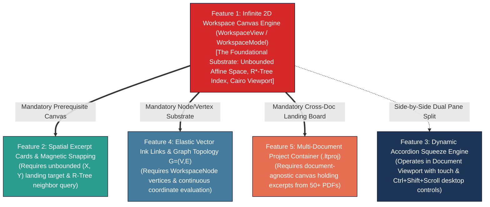
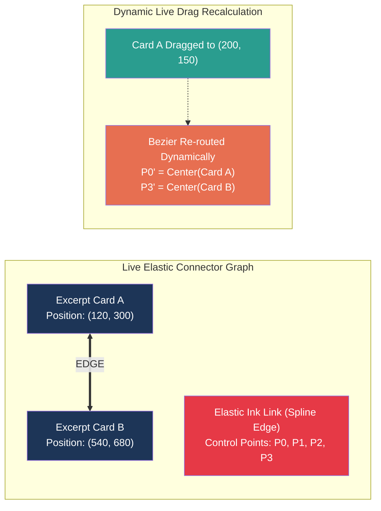

# The Real Thing: Architectural Blueprint for FluidCore Engines in Xournal++

This document presents the complete, uncompromised engineering blueprint to build the **true FluidCore experience** within Xournal++. It details the **Decoupled C++20 Core Engine (`libfluidcore`)** and its integration into Xournal++'s GTK 3 / Cairo frontend: a **genuine infinite 2D workspace canvas**, **spatial movable excerpt cards with magnetic snapping**, **dynamic accordion squeeze with procedural crease rendering**, **elastic relational vector ink links**, and a **multi-document SQLite WAL project container (`.ltproj`)**.

---

## 0. Architectural Dependency Hierarchy: The Infinite Workspace Substrate

> [!IMPORTANT]
> **The Central Architectural Throughline**: Feature #1 (**The Infinite 2D Workspace Canvas Engine**) is the **foundational spatial substrate** upon which Features #2, #4, and #5 strictly depend.
>
> * **Building #1 alone** provides an empty infinite canvas—technically functional, but without active reading capabilities.
> * **Building #2 (Spatial Excerpt Cards), #4 (Elastic Ink Links), or #5 (Multi-Doc Synthesis) without #1 is impossible** because those entities have no coordinate space to live in, no spatial index to query, and no unbounded rendering viewport to land on.



### Why Features #2–5 Are "Things That Live on the Canvas"
1. **Spatial Excerpt Cards (#2) require an unbounded 2D target**: In standard Xournal++, an element can only exist within the rigid bounding box of a specific `XojPage`. `libfluidcore::WorkspaceModel` provides the coordinate space and R*-Tree index for cards to exist independently of pages.
2. **Elastic Ink Links (#4) require a freeform graph node model**: Ink links are directed edges between `WorkspaceNode` instances. Without an independent workspace managing node bounds, an ink link cannot compute dynamic Bezier tangents when cards are repositioned.
3. **Multi-Document Projects (#5) require a unified spatial aggregator**: Synthesizing 50 documents side-by-side is only possible if excerpts from Document $A$ and Document $B$ land on a neutral, document-agnostic infinite canvas.
4. **Decoupled Core Separation**: Keeping `libfluidcore` free from GTK/Cairo dependencies ensures all geometry, R*-Tree queries, and graph operations can be unit-tested in isolation. Core classes expose **pure geometry only** (bounding boxes, node positions, Bezier control points via `FluidCoreAPI`); `WorkspaceView` (the GTK layer) is the sole place where `cairo_t*` rendering functions are invoked.
5. **Rendering Boundary Rule**: No core class (`WorkspaceNode`, `ExcerptCardNode`, `ElasticLinkEdge`, etc.) may declare `render(cairo_t*)` methods or hold `cairo_surface_t*` members; raster clips are owned by the frontend's tile/PdfCache layer and looked up by `(docUuid, pageNo, sourceRect)`.

---

## 1. The Real Infinite 2D Workspace Canvas Engine (`WorkspaceView` & `WorkspaceModel`)

A true unbounded, non-page-bound 2D virtual canvas running parallel to the document pane inside `winWorkspace`, where notes, excerpt cards, sticky notes, and freehand vector ink can be arranged, clustered, panned, and zoomed with zero boundary constraints.

### 1.1 Core Architectural Design
1. **Unbounded Virtual Coordinate System**:
   * World coordinates $(X, Y) \in \mathbb{R}^2$ span from $-\infty$ to $+\infty$ (practical bounding box $[-10^6, +10^6]\text{pt}$).
   * Viewport transformation is managed via a dedicated 2D affine matrix:
     $$\mathbf{M}_{ws} = \begin{bmatrix} s & 0 & t_x \\ 0 & s & t_y \\ 0 & 0 & 1 \end{bmatrix}$$
   * Supports smooth inertial panning, continuous zoom ($10\%$ to $1000\%$), and instant "Zoom to Fit All Cards".
2. **Decoupled Spatial Scene Graph (`WorkspaceModel` in `libfluidcore`)**:
   * Completely independent of Xournal++'s `Document` $\rightarrow$ `XojPage` $\rightarrow$ `Layer` hierarchy.
   * `WorkspaceModel` maintains a flat collection of polymorphic `WorkspaceNode` entities:
     * `ExcerptCardNode`: Extracted PDF snippet cards.
     * `InkedNoteNode`: Freeform vector ink strokes drawn directly on the canvas.
     * `TextBoxNode`: Rich-text and markdown text containers.
     * `CardStackNode`: Collapsible hierarchical topic stacks.
3. **High-Performance Spatial Indexing ($O(\log N)$)**:
   * Uses an R*-Tree spatial index on axis-aligned bounding boxes (AABB).
   * On every render frame, `WorkspaceView` queries the R-Tree with the visible viewport rectangle $\mathbf{Rect}_{screen} \cdot \mathbf{M}_{ws}^{-1}$, culling off-screen elements in $<0.5\text{ms}$ for $N = 100,000$ objects.

```mermaid
classDiagram
    class WorkspaceView {
        -AffineTransform viewMatrix
        -WorkspaceModel* model
        +pan(double dx, double dy)
        +zoom(double factor, Point center)
        +zoomToFit()
        +render(cairo_t* cr)
        +screenToWorld(Point pt) Point
        +worldToScreen(Point pt) Point
    }

    class WorkspaceModel {
        -std::vector~unique_ptr~WorkspaceNode~~ nodes
        -std::vector~unique_ptr~ElasticLinkEdge~~ edges
        -RTreeIndex spatialIndex
        +addNode(unique_ptr~WorkspaceNode~ node) string
        +removeNode(string nodeId)
        +findNodesInRect(Rectangle rect) vector~WorkspaceNode*~
    }

    class WorkspaceNode {
        <<abstract>>
        +string nodeId
        +double posX
        +double posY
        +double width
        +double height
        +int zIndex
        +getBounds() Rectangle
    }

    class ExcerptCardNode {
        +string textSnippet
        +string sourceDocId
        +size_t sourcePageNo
        +XojPdfRectangle sourceRect
        +getBounds() Rectangle
    }

    class CardStackNode {
        +string stackTitle
        +bool isCollapsed
        +vector~WorkspaceNode*~ childCards
        +toggleCollapse()
    }

    WorkspaceView --> WorkspaceModel
    WorkspaceModel *-- WorkspaceNode
    WorkspaceNode <|-- ExcerptCardNode
    WorkspaceNode <|-- CardStackNode```

### 1.2 Implementation Blueprint in Xournal++
* **New Modules**:
  * `libfluidcore/workspace/`: `WorkspaceModel.h/.cpp`, `WorkspaceNode.h`, `ExcerptCardNode.h/.cpp`, `CardStackNode.h/.cpp`, `RTreeIndex.h`.
  * `src/core/gui/workspace/`: `WorkspaceView.h/.cpp` (subclasses `GtkDrawingArea`, managing pointer events, Cairo double-buffered painting, and zoom/pan matrices).
* **Wiring into `MainWindow`**:
  * In `src/core/gui/MainWindow.cpp`, attach `WorkspaceView` directly as the child of `winWorkspace` inside `GtkPaned`.
* **Undo/Redo Framework Integration**:
  * `WorkspaceMoveNodeUndoAction`, `WorkspaceAddNodeUndoAction`, `WorkspaceRemoveNodeUndoAction` operating directly on `(nodeId, oldPos, newPos)`.
  * `LinkCreateUndoAction` / `LinkDeleteUndoAction` for Elastic Ink Link edges (`edgeId`, endpoint node IDs).
  * `StackMergeUndoAction` / `StackSplitUndoAction` for `CardStackNode` formation and dissolution (preserving child card order and prior positions).
  * `AnchorAttachUndoAction` / `AnchorDetachUndoAction` for multi-anchor source binding changes.
  * All actions follow Xournal++'s existing page/layer `UndoAction` pattern (symmetric `undo()`/`redo()` with captured state snapshots).

---

## 2. True Spatial Excerpt Cards, Magnetic Snapping & Hierarchical Stacking

In FluidCore, dragging content from the PDF onto the canvas produces a spatial, interactive card. Users can freely position cards, resize them, snap them magnetically into ordered columns, stack them into collapsible accordion groups (validated up to 5 levels deep), and tap them to trigger deep back-navigation with return pills.

```mermaid
sequenceDiagram
    autonumber
    actor User as User / Stylus
    participant PDF as Document Viewport (XojPageView)
    participant DND as Drag Gesture / DND Controller
    participant WS as Infinite Workspace (WorkspaceView)
    participant Model as WorkspaceModel & R-Tree

    User->>PDF: Lasso Box Region / Select Text
    PDF->>DND: Package ExcerptDropPayload (Text, DocUUID, Page, Rect)
    User->>WS: Drag ghost across GtkPaned boundary to (X, Y)
    WS->>WS: Proximity Check against adjacent Card Edges (Delta R <= 16pt)
    alt Proximity <= 16pt
        WS->>WS: Apply Magnetic Snap Alignment (Snap X or Snap Y)
    end
    User->>WS: Release Pointer (Drop)
    WS->>Model: Instantiate ExcerptCardNode at World Coordinate (X, Y)
    Model->>Model: Insert into R-Tree & Redraw
    WS-->>User: Card active with live Source-Anchor Arrow

    Note over User,PDF: Later during synthesis...
    User->>WS: Tap Source-Anchor Arrow on Excerpt Card
    WS->>PDF: Dispatch NavigateTo(DocUUID, PageNo, Rect)
    PDF->>PDF: Smooth Scroll + Flash Luminous Highlight Pulse
    PDF->>PDF: Show Floating Return Anchor Pill ("Back to Excerpt")
```

### 2.1 Physics-Based Magnetic Snapping Algorithm
When dragging an `ExcerptCardNode` $C_{drag}$ on the workspace:
1. Query the R-Tree for all existing nodes within a search radius $R = \max(\text{width}, \text{height}) + 32\text{pt}$.
2. For each neighbor $C_{near}$, evaluate horizontal and vertical edge distances:
   $$\Delta x_{left} = |C_{drag}.x_0 - C_{near}.x_0|, \quad \Delta x_{right} = |C_{drag}.x_0 - C_{near}.x_1|$$
   $$\Delta y_{top} = |C_{drag}.y_0 - C_{near}.y_1|, \quad \Delta y_{bottom} = |C_{drag}.y_1 - C_{near}.y_0|$$
3. If $\min(\Delta x) \le 16\text{pt}$, snap $C_{drag}.x$ to perfect vertical alignment and render a dynamic cyan magnetic guide line.
4. If $\min(\Delta y) \le 16\text{pt}$, snap $C_{drag}.y$ to dock immediately beneath or above $C_{near}$.

### 2.2 Collapsible Accordion Stacking (`CardStackNode`)
* **Stack Formation**: Dropping Card $B$ directly over Card $A$'s bounding box ($>50\%$ overlap) merges them into a `CardStackNode` (nesting validated up to 5 levels to avoid visual cognitive overload). **Precedence rule**: when both conditions could fire simultaneously, stack-drop ($>50\%$ overlap) wins over magnetic edge snapping; snapping applies only below the overlap threshold.
* **Visual Representation**: Rendered with layered drop shadows and a header bar indicating item count (e.g. `[v] Sovereign Immunity Arguments (4 items)`).
* **Collapse Toggle**: Tapping the header collapses all subordinate cards into a single-line summary pill; tapping again expands them with a smooth animation.

---

## 3. Dynamic Accordion Squeeze & Multi-Hit Squeeze-Search

Pinching a multi-page document or pressing `Ctrl+Shift+Scroll` collapses intermediate pages like an accordion, bringing non-adjacent passages or all search hits into direct vertical contact on a single screen.

```
Normal 100-Page Document View:
+------------------------------------+
| Page 4: Introduction & Methodology |
+------------------------------------+
                  |
                  | [ 87 Pages of Data ] (Requires scrolling 4,000 pixels)
                  v
+------------------------------------+
| Page 92: Conclusions & Limitations |
+------------------------------------+

True Squeezed Accordion View:
+------------------------------------+
| Page 4: Introduction & Methodology |
+====================================+  <-- Cairo Pleated Crease Mesh
| ~ ~ ~ ~ ~ [ 87 Pages Folded ] ~ ~ ~|      (Non-linear coordinate compression)
+====================================+
| Page 92: Conclusions & Limitations |
+------------------------------------+
```

### 3.1 Non-Linear Piecewise Coordinate Mapping Engine (`libfluidcore`)
Instead of rigid linear layout, the Squeeze Engine computes a continuous piecewise deformation function $\mathcal{T}(Y_{doc})$:

$$\mathcal{T}(Y_{doc}) = Y_{doc} - \sum_{i=1}^{k} \max\left(0, \min(H_i, Y_{doc} - S_{i,start})\right) \cdot (1 - \alpha_i)$$

Where:
* $[S_{i,start}, S_{i,end}]$: The $i$-th folded vertical interval.
* $H_i = S_{i,end} - S_{i,start}$: The uncompressed height of the folded region.
* $\alpha_i \in [0.0, 1.0]$: Accordion compression factor. To prevent text distortion during animation, $\alpha_i$ does not scale the raster vertically; instead it drives the vertical slice clipping boundaries and procedural crease shadow opacity.

### 3.2 Dynamic Cairo On-Demand Slicing & Crease Rendering
1. **On-Demand Cairo Slice Rendering**:
   * For visible uncollapsed intervals $[A_j, B_j]$, the renderer translates the Cairo context and clips strictly to the visible slice:
     ```cpp
     void renderSqueezedSlice(cairo_t* cr, size_t pageIndex, double docY_start, double docY_end, double screenY) {
         double sliceHeight = docY_end - docY_start;
         cairo_save(cr);
         cairo_rectangle(cr, 0, screenY, pageWidth, sliceHeight);
         cairo_clip(cr);
         cairo_translate(cr, 0, screenY - docY_start);
         documentView->renderPageRegion(cr, pageIndex, docY_start, docY_end);
         cairo_restore(cr);
     }
     ```
2. **Procedural Pleated Crease Rendering**:
   * Across folded boundaries ($\alpha_i < 0.2$), render a 3D pleated paper shadow effect using a linear gradient pattern:
     ```cpp
     cairo_pattern_t* crease = cairo_pattern_create_linear(0, yCrease, 0, yCrease + 24);
     cairo_pattern_add_color_stop_rgba(crease, 0.0, 0.1, 0.1, 0.1, 0.6);
     cairo_pattern_add_color_stop_rgba(crease, 0.5, 0.9, 0.9, 0.9, 0.2);
     cairo_pattern_add_color_stop_rgba(crease, 1.0, 0.1, 0.1, 0.1, 0.6);
     cairo_set_source(cr, crease);
     cairo_rectangle(cr, 0, yCrease, pageWidth, 24);
     cairo_fill(cr);
     cairo_pattern_destroy(crease);
     ```
3. **Multi-Hit Squeeze Search Mode**:
   * When search is active (or toggled via `Ctrl+Shift+S`), the engine sets uncollapsed intervals around all search matches, setting $\alpha_i = 0.0$ for all intermediate text.

---

## 4. Elastic Vector Ink Links (Dynamic Relational Connectors)

Drawing a stroke with a stylus or mouse between two cards (or between a card and a document margin) establishes a live, persistent **Ink Link**. When either card is dragged around the infinite canvas, the ink connector dynamically stretches, bends, and re-routes its Bezier path in real-time.



### 4.1 Topological Graph Model $G = (V, E)$ in `libfluidcore`
```cpp
namespace FluidCore {

class ElasticLinkEdge {
public:
    std::string edgeId;
    std::string sourceNodeId;
    std::string targetNodeId;
    Color linkColor;
    double strokeWidth;
    
    // Dynamic Parametric Spline Evaluation
    void recalculatePath(const Rectangle& sourceBounds, const Rectangle& targetBounds);
    BezierSpline getControlPoints() const;  // Frontend reads P0..P3 and performs all Cairo rendering
    bool hitTest(Point pt, double tolerance) const;
};

} // namespace FluidCore
```

### 4.2 Dynamic Cubic Bezier Spline Routing Algorithm
When Card $A$ moves:
1. Select the pair of boundary anchor points $(\mathbf{P}_0, \mathbf{P}_3)$ between Card $A$ and Card $B$ that minimizes Euclidean distance $\|\mathbf{P}_3 - \mathbf{P}_0\|$.
2. Compute tangent control points $(\mathbf{P}_1, \mathbf{P}_2)$ extending along the outward normal vectors $\mathbf{n}_0, \mathbf{n}_3$:
   $$\mathbf{P}_1 = \mathbf{P}_0 + \mathbf{n}_0 \cdot \frac{\|\mathbf{P}_3 - \mathbf{P}_0\|}{3}, \quad \mathbf{P}_2 = \mathbf{P}_3 + \mathbf{n}_3 \cdot \frac{\|\mathbf{P}_3 - \mathbf{P}_0\|}{3}$$
3. Render the dynamic stroke in Cairo using `cairo_curve_to(cr, P1.x, P1.y, P2.x, P2.y, P3.x, P3.y)`.
4. Tapping either anchor endpoint smoothly centers the opposite connected card or document passage in the viewport.

---

## 5. Multi-Document Project Container (`.ltproj`)

FluidCore allows importing 50+ documents into one project. Excerpts from Document $A$ and Document $B$ sit side-by-side on the same infinite canvas with ink links between them.

### 5.1 Container File Structure (`.ltproj` Directory Bundle / Archive)
```
[Project.ltproj/] (Runtime Directory Bundle / Compressed Archive on Export)
├── project.db                  # SQLite 3 Database (WAL enabled)
├── project.db-wal              # Active Write-Ahead Log (Sub-500ms debounce against process crashes)
├── project.db-shm              # SQLite Shared Memory Index
├── metadata.json               # Manifest, document UUID mappings, schema version
├── /documents/                 # Immutable Source Documents
│   ├── {doc_uuid_1}.pdf
│   └── {doc_uuid_2}.pdf
├── /assets/                    # Extracted Raster Clips
│   ├── /clips/{clip_uuid}.png
│   └── /images/{img_uuid}.png
└── /cache/                     # Thumbnails & Rendering Tiles
    └── /thumbnails/{doc_uuid}/p_{page_idx}.webp
```

---

## 6. Implementation Roadmap & Milestones

| Phase | Core Deliverable | Target Modules |
| :--- | :--- | :--- |
| **Phase 1** | **Decoupled Core & Workspace Canvas** | Build `libfluidcore/workspace/` (`WorkspaceModel`, `RTreeIndex`, affine matrix transform), create GTK3 `WorkspaceView`. |
| **Phase 2** | **Spatial Excerpt Cards & Drag-and-Drop** | Implement custom overlay drag gesture & GTK3 DND, `ExcerptCardNode`, magnetic snapping physics, and return pills. |
| **Phase 3** | **Elastic Vector Ink Links** | Implement `ElasticLinkEdge` in `libfluidcore`, cubic Bezier curve recalculation during card drag, and endpoint navigation. |
| **Phase 4** | **True Accordion Squeeze Engine** | Implement piecewise coordinate mapper $\mathcal{T}(Y_{doc})$, `Ctrl+Shift+Scroll` / `Ctrl+Shift+S` desktop squeeze, margin fold pins, and Cairo slice rendering. |
| **Phase 5** | **Export Pipeline & Multi-Doc Synthesis** | Implement `.ltproj` directory bundle & SQLite WAL storage, SQLite FTS5 project search, PDF/DOCX/Markdown exporter, document UUID namespaces, and standard DEFLATE archive packaging. |

---

*This concludes the complete architectural blueprint for the FluidCore engine.*
