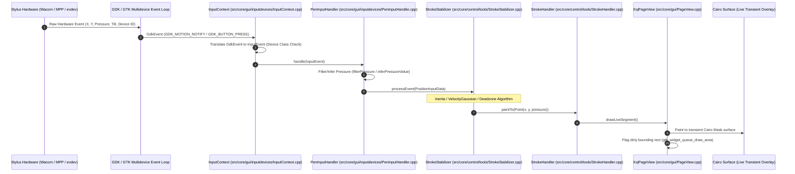
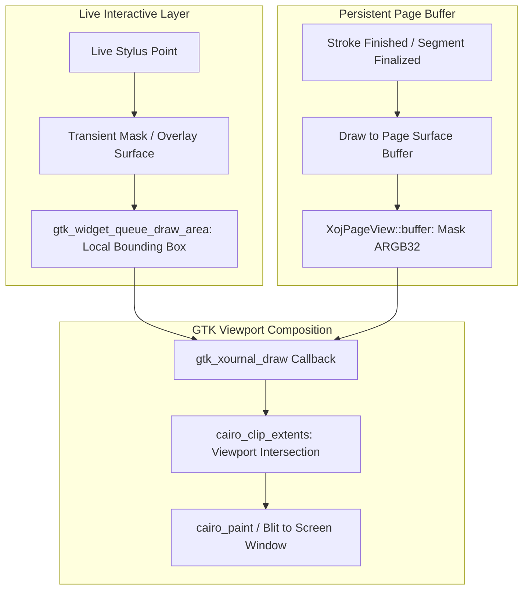
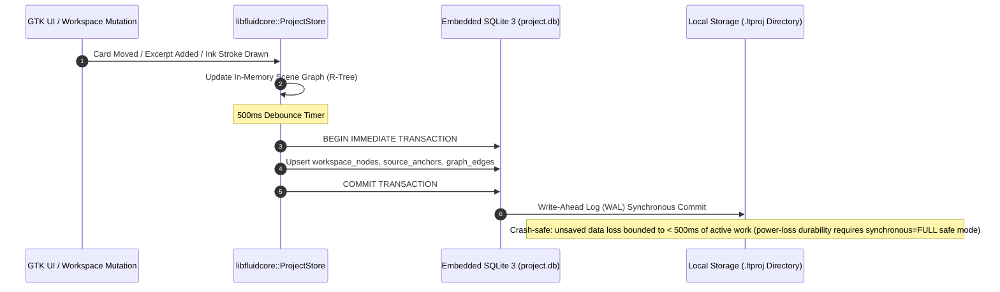

# Xournal++ & FluidCore System Architecture & Hardware Interaction Deep Dive

This document provides a comprehensive, technically rigorous architectural breakdown of **Xournal++** augmented by the **Decoupled C++20 Core Engine (`libfluidcore`)**, combining GTK 3, Cairo 2D, Poppler GLib, and SQLite 3 WAL.

---

## 1. High-Level Architectural Overview

The system is architected using a decoupled Model-View-Controller (MVC) pattern paired with a **standalone pure C++ Core Engine (`libfluidcore`)**, an asynchronous Job Scheduling subsystem, a dedicated Hardware Input Abstraction Context, an Undo/Redo Command framework, and an SQLite 3 WAL persistence layer.

```mermaid
graph TB
    subgraph Hardware & Input Layer
        HW_PEN["Active Stylus / Digitizer"]
        HW_TOUCH["Capacitive Touchscreen"]
        HW_DESKTOP["Keyboard & Mouse (Ctrl+Shift+Scroll / Margin Pins)"]
        HW_DISP["Display (60 / 120Hz)"]
    end

    subgraph Hardware Abstraction & Input Layer (GTK 3)
        GTK_EVT["GDK Multidevice Event Loop"]
        IN_CTX["InputContext"]
        HAND_REC["HandRecognition / Palm Rejection"]
        PEN_HDL["PenInputHandler & StylusInputHandler"]
        TOUCH_HDL["TouchInputHandler (Pinch Squeeze)"]
        DESK_HDL["DesktopSqueezeHandler (Ctrl+Shift+Scroll / Margin Pins)"]
        STABILIZER["StrokeStabilizer: Inertia / Gaussian / Deadzone"]
    end

    subgraph Controller & Business Logic
        MAIN_CTRL["Control Hub"]
        TOOL_HDL["ToolHandler & Tools"]
        SQUEEZE_CTRL["SqueezeController"]
        SCHED["XournalScheduler & ThreadPool"]
        PDF_CACHE["PdfCache: LRU & Zoom Invalidation"]
    end

    subgraph Decoupled Core Engine (libfluidcore / C++20)
        FC_API["FluidCore C++ Interface"]
        WS_MODEL["WorkspaceModel (Scene Graph)"]
        RTREE["R*-Tree Spatial Index (AABB)"]
        SQ_ENG["SqueezeEngine (Piecewise Mapper T(Y))"]
        GRAPH_TOP["GraphTopology G=(V, E)"]
        BEZIER["Cubic Bezier Spline Router"]
        FTS_ENG["SQLite FTS5 Full-Text Index"]
        WAL_STORE["ProjectStore (SQLite WAL)"]
    end

    subgraph Dual-Pane View & Rendering (GTK 3 / Cairo)
        MAIN_WIN["MainWindow (GtkPaned Container)"]
        X_VIEW["Document Viewport (XournalView / Cairo)"]
        WS_VIEW["Infinite Workspace (WorkspaceView / Cairo)"]
        PAGE_VIEW["XojPageView (On-Demand Slice Rendering)"]
        RETURN_PILL["ReturnAnchorPill Floating Viewport Overlay"]
    end

    subgraph Document Model & Local Storage
        DOC["Document (Poppler PDF Background)"]
        SQLITE_WAL["SQLite 3 DB (project.db + WAL)"]
        LTPROJ["Local .ltproj Directory Bundle"]
    end

    HW_PEN --> GTK_EVT
    HW_TOUCH --> GTK_EVT
    HW_DESKTOP --> GTK_EVT
    GTK_EVT --> IN_CTX
    IN_CTX --> HAND_REC
    IN_CTX --> PEN_HDL
    IN_CTX --> TOUCH_HDL
    IN_CTX --> DESK_HDL
    PEN_HDL --> STABILIZER
    STABILIZER --> TOOL_HDL

    TOOL_HDL --> MAIN_CTRL
    TOUCH_HDL --> SQUEEZE_CTRL
    DESK_HDL --> SQUEEZE_CTRL
    SQUEEZE_CTRL --> SQ_ENG

    MAIN_CTRL --> FC_API
    FC_API --> WS_MODEL
    FC_API --> GRAPH_TOP
    FC_API --> WAL_STORE
    WS_MODEL --> RTREE

    MAIN_CTRL --> MAIN_WIN
    MAIN_WIN --> X_VIEW
    MAIN_WIN --> WS_VIEW
    X_VIEW --> PAGE_VIEW
    X_VIEW --> RETURN_PILL

    WAL_STORE --> SQLITE_WAL
    WAL_STORE --> LTPROJ
```

---

## 2. Hardware Interaction Subsystems & Efficiency

A central design requirement is real-time processing of high-frequency input hardware events while minimizing jitter, CPU consumption, and rendering latency.

### 2.1 Digitizer & Stylus Input Pipeline

The stylus pipeline processes high-rate hardware interrupt streams from digitizers. The primary supported target is the Linux desktop stack (Wayland/X11 `evdev` and `libinput`) for Wacom EMR/AES devices, with basic support on Windows and macOS.



#### Key Implementation Details:
1. **Multidevice Support & Device Class Filtering**:
   - `InputContext.cpp` queries `gdk_event_get_source_device()` to identify hardware relationships.
   - Devices are dynamically classified into `INPUT_DEVICE_PEN`, `INPUT_DEVICE_ERASER`, `INPUT_DEVICE_MOUSE`, `INPUT_DEVICE_TOUCHSCREEN`, and `INPUT_DEVICE_IGNORE`.
2. **Dual Desktop & Touch Routing**:
   - Touch gestures are dispatched to `TouchInputHandler` for pinch-to-squeeze and multi-touch panning. To prevent conflict with zoom/pan, touch squeeze applies strict gesture disambiguation: the primary axis test is angular deviation $\le 25^\circ$ from the vertical axis (resolution/DPI-independent), while pixel-delta thresholds ($>40\text{px}$ vertical travel, $<15\text{px}$ horizontal drift) serve only as a minimum-movement noise filter before triggering `EVENT_SQUEEZE_START`.
   - Keyboard/mouse events are intercepted by `DesktopSqueezeHandler`: `Ctrl+Shift+Scroll` triggers accordion folding at the cursor Y position; `Ctrl+Shift+S` activates search squeeze mode; `Shift/Space-hold` invokes `beginPeek()`/`endPeek()`.

---

### 2.2 Vector Rendering & Display Optimization (Cairo 2D Engine)

Rendering uses **Cairo 2D** CPU vector rasterization integrated with GTK 3 drawing windows. Direct full-page software rendering on HiDPI displays on every stroke point would drop frames. The system targets **30 FPS CPU rendering** using **two-tier damage tracking & dual-surface caching**.



#### Optimization Techniques:
1. **Transient Mask Overlay vs. Persistent Page Buffer**:
   - While a stroke is active, `StrokeViewHelper` renders only the newest stroke segment to an active transient Cairo overlay context.
   - Completed strokes are baked into the page buffer, avoiding full-page re-rasterization.
2. **Dirty Rectangle Damage Tracking**:
   - `XojPageView::rerenderRect` aggregates affected bounding boxes in `rerenderRects`, coalescing overlapping rectangles with `r.unite(rect)` to restrict repainting strictly to dirty areas.
3. **On-Demand Squeeze Slice Rendering**:
   - During dynamic accordion squeezing, `SqueezedPageView` renders uncollapsed vertical intervals on demand using Cairo translation and clipping, completely bypassing offscreen unrendered pages.

---

### 2.3 Decoupled Spatial Indexing & Graph Traversal (`libfluidcore`)

All spatial queries and graph topology operations execute within `libfluidcore` with zero UI framework dependencies:
1. **R*-Tree Viewport Culling**: The axis-aligned bounding boxes (AABB) of all workspace nodes are indexed in an R*-Tree, enabling $O(\log N)$ viewport culling queries in $<0.5\text{ms}$ for $N=100{,}000$ objects.
2. **Elastic Spline Routing**: When an excerpt card moves, `ElasticLinkEdge` recalculates dynamic cubic Bezier splines between outward normal vectors of connected card anchors in real-time.

---

### 2.4 Persistence & Crash-Safety Protocol (SQLite WAL)



- **Write-Ahead Logging**: SQLite operates in WAL mode (`PRAGMA journal_mode = WAL; PRAGMA synchronous = NORMAL;`). Background writes never block concurrent read queries. During explicit milestone saves or application shutdown, `PRAGMA wal_checkpoint(TRUNCATE)` is invoked to flush changes synchronously to disk. An optional **Safe Mode** (Settings toggle) switches to `PRAGMA synchronous = FULL`, trading write throughput for full power-loss durability.

---

*This concludes the complete System Architecture & Hardware Interaction Deep Dive.*
